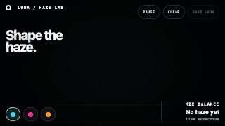
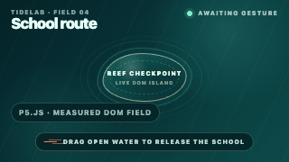
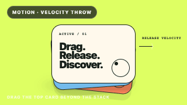
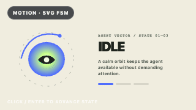
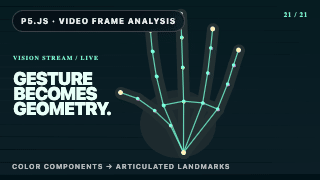
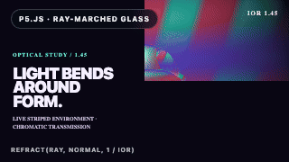

# Awesome Web Effects

[English](README.md) · [简体中文](README.zh-Hans.md) · [हिन्दी](README.hi.md) · [Español](README.es.md) · [العربية](README.ar.md) · [Français](README.fr.md) · [বাংলা](README.bn.md) · [Português](README.pt.md) · [Bahasa Indonesia](README.id.md) · [اردو](README.ur.md) · [Русский](README.ru.md) · [Deutsch](README.de.md) · [日本語](README.ja.md) · [Naijá](README.pcm.md) · [العربي المصري](README.arz.md) · [मराठी](README.mr.md) · [Tiếng Việt](README.vi.md) · [తెలుగు](README.te.md) · [Kiswahili](README.sw.md) · [Hausa](README.ha.md)

[Open the live visual catalog](https://giraffe-tree.github.io/awesome-web-effects/?lang=en) · [Language metadata](docs/LANGUAGES.md)

<p align="center"><strong>See the interaction. Learn its name. Copy the code or agent prompt.</strong></p>
<p align="center">A visual atlas for the moment when you know the feeling you want, but not the words to describe the effect.</p>

<table>
<tr><td width="33%" align="center"><a href="https://giraffe-tree.github.io/awesome-web-effects/?lang=en#synchronized-scenario-scene-handoff"></a><br><sub><strong>Synchronized scenario scene handoff</strong><br>Page &amp; layout · 98/100</sub></td><td width="33%" align="center"><a href="https://giraffe-tree.github.io/awesome-web-effects/?lang=en#pointer-injected-gpu-fluid"></a><br><sub><strong>Stage haze colour lab</strong><br>3D &amp; WebGL · 99/100</sub></td><td width="33%" align="center"><a href="https://giraffe-tree.github.io/awesome-web-effects/?lang=en#dom-aware-drag-spawned-fish-flock"></a><br><sub><strong>DOM-aware drag-spawned fish flock</strong><br>Canvas &amp; 2D · 98/100</sub></td></tr>
<tr><td width="33%" align="center"><a href="https://giraffe-tree.github.io/awesome-web-effects/?lang=en#traveling-dot-headline-rewriter"></a><br><sub><strong>Human-approved headline revision marker</strong><br>Text &amp; SVG · 100/100</sub></td><td width="33%" align="center"><a href="https://giraffe-tree.github.io/awesome-web-effects/?lang=en#drag-thrown-card-stack"></a><br><sub><strong>Drag-thrown card stack</strong><br>Pointer &amp; hover · 94/100</sub></td><td width="33%" align="center"><a href="https://giraffe-tree.github.io/awesome-web-effects/?lang=en#scroll-scrubbed-document-generation-playback"></a><br><sub><strong>Scroll-scrubbed document generation playback</strong><br>Scroll &amp; reveal · 97/100</sub></td></tr>
<tr><td width="33%" align="center"><a href="https://giraffe-tree.github.io/awesome-web-effects/?lang=en#interactive-vector-state-machine"></a><br><sub><strong>Held-input room-scene assistant</strong><br>Motion &amp; choreography · 94/100</sub></td><td width="33%" align="center"><a href="https://giraffe-tree.github.io/awesome-web-effects/?lang=en#live-hand-landmark-video-overlay"></a><br><sub><strong>Hand rehabilitation landmark calibration</strong><br>Canvas &amp; 2D · 98/100</sub></td><td width="33%" align="center"><a href="https://giraffe-tree.github.io/awesome-web-effects/?lang=en#refractive-glass-transmission-sculpture"></a><br><sub><strong>Glass under light optical material review</strong><br>3D &amp; WebGL · 99/100</sub></td></tr>
</table>

<p align="center"><a href="https://giraffe-tree.github.io/awesome-web-effects/?lang=en"><strong>Explore all 150 live effects →</strong></a></p>

<a id="agent-quick-start"></a>

## Use with any coding agent in one prompt

No skill or installation is required. Copy this single sentence into Codex, Claude Code, or another coding agent while your target project is open.

```text
Inspect the current project and use the complete Awesome Web Effects catalog (https://giraffe-tree.github.io/awesome-web-effects/; if the page is unreadable, inspect demo/data/effects.js and demo/preview-demos/ in the read-only GitHub repository at https://github.com/giraffe-tree/awesome-web-effects) strictly as a reference: choose the single effect that best fits the product goal, existing visual language, key user flow, and stack, adding a second only when it provides clear complementary and non-conflicting value; study each chosen entry's verified preview, runnable demo when available, minimal code, and dedicated Agent Prompt, then adapt and implement it directly in the current project using existing dependencies where practical and original assets, without copying source-site branding or proprietary code or modifying the reference repository, while preserving responsive behavior, keyboard, pointer, and touch accessibility, prefers-reduced-motion, performance, and resource cleanup; run the existing tests and an available browser check, fix any issues, and finish by reporting the selected effects, changed files, and verification results, and if neither reference can be accessed, do not invent an effect and report the blocker.
```

<p align="center"><a href="https://giraffe-tree.github.io/awesome-web-effects/?lang=en#agent-prompt"><strong>Copy the one-line prompt on the live site →</strong></a></p>

## See it. Name it. Build it.

<table><tr><td width="25%" align="center"><strong>150</strong><br><sub>admitted effects</sub></td><td width="25%" align="center"><strong>150</strong><br><sub>real GIFs</sub></td><td width="25%" align="center"><strong>148</strong><br><sub>runnable demos</sub></td><td width="25%" align="center"><strong>80/100</strong><br><sub>minimum score</sub></td></tr></table>

<table><tr><td width="33%"><strong>① Find by sight</strong><br><sub>Scan real motion instead of guessing library names.</sub></td><td width="33%"><strong>② Open the effect</strong><br><sub>Check the score, source, behavior and minimal implementation.</sub></td><td width="33%"><strong>③ Ship the idea</strong><br><sub>Copy code or a scoped prompt for Codex / Claude Code.</sub></td></tr></table>

This is an **effect-first**, curator-reviewed reference—not another repository list. Every published item has visible evidence, a score of at least **80/100**, provenance, reusable code and a runnable or official preview.

## Browse by visual family

| Category | Effects | Source projects | Visible result |
| --- | ---: | ---: | --- |
| [Motion & choreography](https://giraffe-tree.github.io/awesome-web-effects/#catalog) | 18 | 7 | Timelines, springs, tweens, class animation, and framework-native motion. |
| [Scroll & reveal](https://giraffe-tree.github.io/awesome-web-effects/#catalog) | 12 | 3 | Smooth scrolling, scroll-linked scenes, reveals, parallax, and snap navigation. |
| [Page & layout](https://giraffe-tree.github.io/awesome-web-effects/#catalog) | 15 | 3 | Page transitions, FLIP motion, filtering, packing, and animated reflow. |
| [Pointer & hover](https://giraffe-tree.github.io/awesome-web-effects/#catalog) | 24 | 5 | Tilt, depth, custom cursors, magnetic motion, and image distortion. |
| [Text & SVG](https://giraffe-tree.github.io/awesome-web-effects/#catalog) | 23 | 3 | Typing, text splitting, vector drawing, handwriting, and SVG morphing. |
| [Canvas & 2D](https://giraffe-tree.github.io/awesome-web-effects/#catalog) | 45 | 3 | Scene graphs, creative coding, physics, drawing tools, and 2D renderers. |
| [3D & WebGL](https://giraffe-tree.github.io/awesome-web-effects/#catalog) | 13 | 3 | 3D engines, declarative renderers, shader layers, and post-processing. |

<details>
<summary><strong>Open the complete 150-effect index</strong> — implementation, score, source and direct link</summary>

<a id="animation"></a>

### Motion & choreography

Timelines, springs, tweens, class animation, and framework-native motion.

| Effect | Recommended implementation | Curatorial score | AI homepage references (max 3) | Stars | Implementations | Status | Implementation |
| --- | --- | ---: | --- | ---: | ---: | --- | --- |
| [Scroll-scrubbed master timeline](https://giraffe-tree.github.io/awesome-web-effects/#scroll-scrubbed-master-timeline) | [GSAP](https://github.com/greensock/GSAP) | **85/100** | [Hebbia](https://www.hebbia.com/)<br>[Decagon](https://decagon.ai/) | 26,600 | 1 | Recommended | [Score + code + prompt](https://giraffe-tree.github.io/awesome-web-effects/#scroll-scrubbed-master-timeline) |
| [Shared-layout spring morph](https://giraffe-tree.github.io/awesome-web-effects/#shared-layout-spring-morph) | [Motion](https://github.com/motiondivision/motion) | **94/100** | — | 32,819 | 1 | Recommended | [Score + code + prompt](https://giraffe-tree.github.io/awesome-web-effects/#shared-layout-spring-morph) |
| [Staggered transform choreography](https://giraffe-tree.github.io/awesome-web-effects/#staggered-transform-choreography) | [Anime.js](https://github.com/juliangarnier/anime) | **92/100** | [Factory](https://factory.ai/)<br>[Read AI](https://www.read.ai/)<br>[Cursor (Anysphere)](https://cursor.com/) | 71,056 | 1 | Recommended | [Score + code + prompt](https://giraffe-tree.github.io/awesome-web-effects/#staggered-transform-choreography) |
| [Motion-graphics burst](https://giraffe-tree.github.io/awesome-web-effects/#motion-graphics-burst) | [Mo.js](https://github.com/mojs/mojs) | **92/100** | — | 18,728 | 1 | Recommended | [Score + code + prompt](https://giraffe-tree.github.io/awesome-web-effects/#motion-graphics-burst) |
| [Visually authored keyframe sequence](https://giraffe-tree.github.io/awesome-web-effects/#visually-authored-keyframe-sequence) | [Theatre.js](https://github.com/theatre-js/theatre) | **84/100** | — | 12,541 | 1 | Recommended | [Score + code + prompt](https://giraffe-tree.github.io/awesome-web-effects/#visually-authored-keyframe-sequence) |
| [Compact SVG shape tween](https://giraffe-tree.github.io/awesome-web-effects/#compact-svg-shape-tween) | [KUTE.js](https://github.com/thednp/kute.js) | **89/100** | — | 2,639 | 1 | Recommended | [Score + code + prompt](https://giraffe-tree.github.io/awesome-web-effects/#compact-svg-shape-tween) |
| [Named-agent artifact handoff](https://giraffe-tree.github.io/awesome-web-effects/#autonomous-agent-cursor-constellation) | [Motion](https://github.com/motiondivision/motion) | **100/100** | [InVideo](https://invideo.io/) | 32,819 | 1 | Recommended | [Score + code + prompt](https://giraffe-tree.github.io/awesome-web-effects/#autonomous-agent-cursor-constellation) |
| [Duration-aware hero film handoff](https://giraffe-tree.github.io/awesome-web-effects/#duration-aware-hero-film-handoff) | [Motion](https://github.com/motiondivision/motion) | **94/100** | [Kling](https://kling.ai/) | 32,819 | 1 | Recommended | [Score + code + prompt](https://giraffe-tree.github.io/awesome-web-effects/#duration-aware-hero-film-handoff) |
| [Hover-rehearsed video style rail](https://giraffe-tree.github.io/awesome-web-effects/#hover-rehearsed-video-style-rail) | [Motion](https://github.com/motiondivision/motion) | **95/100** | [Captions](https://captions.ai/) | 32,819 | 1 | Recommended | [Score + code + prompt](https://giraffe-tree.github.io/awesome-web-effects/#hover-rehearsed-video-style-rail) |
| [Device-silhouette masked video](https://giraffe-tree.github.io/awesome-web-effects/#device-silhouette-masked-video) | [Motion](https://github.com/motiondivision/motion) | **92/100** | [Pika](https://pika.art/) | 32,819 | 1 | Recommended | [Score + code + prompt](https://giraffe-tree.github.io/awesome-web-effects/#device-silhouette-masked-video) |
| [Blurred autoplay video ambience](https://giraffe-tree.github.io/awesome-web-effects/#blurred-autoplay-video-ambience) | [Motion](https://github.com/motiondivision/motion) | **91/100** | [Replicate](https://replicate.com/) | 32,819 | 1 | Recommended | [Score + code + prompt](https://giraffe-tree.github.io/awesome-web-effects/#blurred-autoplay-video-ambience) |
| [Visibility-gated agent terminal replay](https://giraffe-tree.github.io/awesome-web-effects/#visibility-gated-agent-terminal-replay) | [Motion](https://github.com/motiondivision/motion) | **93/100** | [Poolside](https://poolside.ai/) | 32,819 | 1 | Recommended | [Score + code + prompt](https://giraffe-tree.github.io/awesome-web-effects/#visibility-gated-agent-terminal-replay) |
| [Track-card play-state handoff](https://giraffe-tree.github.io/awesome-web-effects/#track-card-play-state-handoff) | [Motion](https://github.com/motiondivision/motion) | **84/100** | [Udio](https://www.udio.com/) | 32,819 | 1 | Recommended | [Score + code + prompt](https://giraffe-tree.github.io/awesome-web-effects/#track-card-play-state-handoff) |
| [Held-input room-scene assistant](https://giraffe-tree.github.io/awesome-web-effects/#interactive-vector-state-machine) | [Motion](https://github.com/motiondivision/motion) | **94/100** | — | 32,819 | 1 | Recommended | [Score + code + prompt](https://giraffe-tree.github.io/awesome-web-effects/#interactive-vector-state-machine) |
| [Image-palette ambient color transition](https://giraffe-tree.github.io/awesome-web-effects/#image-palette-ambient-color-transition) | [p5.js](https://github.com/processing/p5.js) | **92/100** | — | 23,797 | 1 | Recommended | [Score + code + prompt](https://giraffe-tree.github.io/awesome-web-effects/#image-palette-ambient-color-transition) |
| [BlurHash-to-photo progressive reveal](https://giraffe-tree.github.io/awesome-web-effects/#blurhash-to-photo-progressive-reveal) | [p5.js](https://github.com/processing/p5.js) | **88/100** | — | 23,797 | 1 | Recommended | [Score + code + prompt](https://giraffe-tree.github.io/awesome-web-effects/#blurhash-to-photo-progressive-reveal) |
| [Harbor Arts folding route map](https://giraffe-tree.github.io/awesome-web-effects/#kinetic-paper-fold-map) | [p5.js](https://github.com/processing/p5.js) | **100/100** | — | 23,797 | 1 | Recommended | [Score + code + prompt](https://giraffe-tree.github.io/awesome-web-effects/#kinetic-paper-fold-map) |
| [Harbor Hall seat-release proof](https://giraffe-tree.github.io/awesome-web-effects/#spring-loaded-split-flap-counter) | [Motion](https://github.com/motiondivision/motion) | **100/100** | — | 32,819 | 1 | Recommended | [Score + code + prompt](https://giraffe-tree.github.io/awesome-web-effects/#spring-loaded-split-flap-counter) |

<a id="scroll"></a>

### Scroll & reveal

Smooth scrolling, scroll-linked scenes, reveals, parallax, and snap navigation.

| Effect | Recommended implementation | Curatorial score | AI homepage references (max 3) | Stars | Implementations | Status | Implementation |
| --- | --- | ---: | --- | ---: | ---: | --- | --- |
| [Pinned horizontal scroll scene](https://giraffe-tree.github.io/awesome-web-effects/#pinned-horizontal-scroll-scene) | [GSAP](https://github.com/greensock/GSAP) | **96/100** | — | 26,600 | 1 | Recommended | [Score + code + prompt](https://giraffe-tree.github.io/awesome-web-effects/#pinned-horizontal-scroll-scene) |
| [Scroll-linked observatory field guide](https://giraffe-tree.github.io/awesome-web-effects/#scroll-linked-multilayer-starfield) | [p5.js](https://github.com/processing/p5.js) | **94/100** | [Fathom](https://fathom.video/) | 23,797 | 1 | Recommended | [Score + code + prompt](https://giraffe-tree.github.io/awesome-web-effects/#scroll-linked-multilayer-starfield) |
| [Contrast-aware fixed navigation reader](https://giraffe-tree.github.io/awesome-web-effects/#self-inverting-fixed-navigation) | [Motion](https://github.com/motiondivision/motion) | **100/100** | [Luma AI](https://lumalabs.ai/) | 32,819 | 1 | Recommended | [Score + code + prompt](https://giraffe-tree.github.io/awesome-web-effects/#self-inverting-fixed-navigation) |
| [Scroll-scrubbed document generation playback](https://giraffe-tree.github.io/awesome-web-effects/#scroll-scrubbed-document-generation-playback) | [Motion](https://github.com/motiondivision/motion) | **97/100** | [Granola](https://www.granola.ai/) | 32,819 | 1 | Recommended | [Score + code + prompt](https://giraffe-tree.github.io/awesome-web-effects/#scroll-scrubbed-document-generation-playback) |
| [Inertial vertical capability rail](https://giraffe-tree.github.io/awesome-web-effects/#inertial-vertical-capability-rail) | [Motion](https://github.com/motiondivision/motion) | **91/100** | [Augmentcode](https://www.augmentcode.com/) | 32,819 | 1 | Recommended | [Score + code + prompt](https://giraffe-tree.github.io/awesome-web-effects/#inertial-vertical-capability-rail) |
| [DOM-to-spatial-artifact registration](https://giraffe-tree.github.io/awesome-web-effects/#dom-to-3d-scroll-synchronization) | [Motion](https://github.com/motiondivision/motion) | **95/100** | — | 32,819 | 1 | Recommended | [Score + code + prompt](https://giraffe-tree.github.io/awesome-web-effects/#dom-to-3d-scroll-synchronization) |
| [Incident review card stack](https://giraffe-tree.github.io/awesome-web-effects/#sticky-card-stack-accumulation) | [Motion](https://github.com/motiondivision/motion) | **99/100** | — | 32,819 | 1 | Recommended | [Score + code + prompt](https://giraffe-tree.github.io/awesome-web-effects/#sticky-card-stack-accumulation) |
| [Metrobrief arrival velocity board](https://giraffe-tree.github.io/awesome-web-effects/#velocity-reactive-marquee) | [Motion](https://github.com/motiondivision/motion) | **99/100** | — | 32,819 | 1 | Recommended | [Score + code + prompt](https://giraffe-tree.github.io/awesome-web-effects/#velocity-reactive-marquee) |
| [Scrubbed word blur-and-rotate reveal](https://giraffe-tree.github.io/awesome-web-effects/#scrubbed-word-blur-rotate-reveal) | [Motion](https://github.com/motiondivision/motion) | **93/100** | — | 32,819 | 1 | Recommended | [Score + code + prompt](https://giraffe-tree.github.io/awesome-web-effects/#scrubbed-word-blur-rotate-reveal) |
| [Sticky paragraph ink reveal](https://giraffe-tree.github.io/awesome-web-effects/#sticky-paragraph-ink-reveal) | [Motion](https://github.com/motiondivision/motion) | **91/100** | — | 32,819 | 1 | Recommended | [Score + code + prompt](https://giraffe-tree.github.io/awesome-web-effects/#sticky-paragraph-ink-reveal) |
| [Human-scrubbed greenhouse growth study](https://giraffe-tree.github.io/awesome-web-effects/#scroll-controlled-video-scrubbing) | [p5.js](https://github.com/processing/p5.js) | **99/100** | [Motion](https://motion.dev/docs/react-use-scroll) | 23,797 | 1 | Recommended | [Score + code + prompt](https://giraffe-tree.github.io/awesome-web-effects/#scroll-controlled-video-scrubbing) |
| [North Spur field-node commissioning](https://giraffe-tree.github.io/awesome-web-effects/#scroll-stitched-isometric-blueprint) | [Motion](https://github.com/motiondivision/motion) | **100/100** | — | 32,819 | 1 | Recommended | [Score + code + prompt](https://giraffe-tree.github.io/awesome-web-effects/#scroll-stitched-isometric-blueprint) |

<a id="transition"></a>

### Page & layout

Page transitions, FLIP motion, filtering, packing, and animated reflow.

| Effect | Recommended implementation | Curatorial score | AI homepage references (max 3) | Stars | Implementations | Status | Implementation |
| --- | --- | ---: | --- | ---: | ---: | --- | --- |
| [Filterable grid reflow](https://giraffe-tree.github.io/awesome-web-effects/#filterable-grid-reflow) | [Isotope](https://github.com/metafizzy/isotope) | **85/100** | [Ideogram](https://ideogram.ai/) | 11,103 | 1 | Legacy | [Score + code + prompt](https://giraffe-tree.github.io/awesome-web-effects/#filterable-grid-reflow) |
| [Synchronized scenario scene handoff](https://giraffe-tree.github.io/awesome-web-effects/#synchronized-scenario-scene-handoff) | [Motion](https://github.com/motiondivision/motion) | **98/100** | [Vapi](https://vapi.ai/) | 32,819 | 1 | Recommended | [Score + code + prompt](https://giraffe-tree.github.io/awesome-web-effects/#synchronized-scenario-scene-handoff) |
| [Delayed dropdown promo sweep](https://giraffe-tree.github.io/awesome-web-effects/#delayed-dropdown-promo-sweep) | [Motion](https://github.com/motiondivision/motion) | **92/100** | [Glean](https://www.glean.com/) | 32,819 | 1 | Recommended | [Score + code + prompt](https://giraffe-tree.github.io/awesome-web-effects/#delayed-dropdown-promo-sweep) |
| [Publication index curtain](https://giraffe-tree.github.io/awesome-web-effects/#clip-path-menu-curtain) | [Motion](https://github.com/motiondivision/motion) | **89/100** | [Anthropic](https://www.anthropic.com/) | 32,819 | 1 | Recommended | [Score + code + prompt](https://giraffe-tree.github.io/awesome-web-effects/#clip-path-menu-curtain) |
| [Cultural-program full-scene wipe](https://giraffe-tree.github.io/awesome-web-effects/#scene-wipe-progressive-page-swap) | [Motion](https://github.com/motiondivision/motion) | **90/100** | — | 32,819 | 1 | Recommended | [Score + code + prompt](https://giraffe-tree.github.io/awesome-web-effects/#scene-wipe-progressive-page-swap) |
| [Issue-wall extraction and repair](https://giraffe-tree.github.io/awesome-web-effects/#draggable-packed-editorial-wall) | [Motion](https://github.com/motiondivision/motion) | **88/100** | — | 32,819 | 1 | Recommended | [Score + code + prompt](https://giraffe-tree.github.io/awesome-web-effects/#draggable-packed-editorial-wall) |
| [Velocity-aware cycle-route drawer](https://giraffe-tree.github.io/awesome-web-effects/#velocity-aware-swipe-drawer) | [Motion](https://github.com/motiondivision/motion) | **85/100** | — | 32,819 | 1 | Recommended | [Score + code + prompt](https://giraffe-tree.github.io/awesome-web-effects/#velocity-aware-swipe-drawer) |
| [Harbor review spatial deck](https://giraffe-tree.github.io/awesome-web-effects/#spatial-slide-deck-navigation) | [Motion](https://github.com/motiondivision/motion) | **88/100** | — | 32,819 | 1 | Recommended | [Score + code + prompt](https://giraffe-tree.github.io/awesome-web-effects/#spatial-slide-deck-navigation) |
| [Semantic field-dispatch pixel dissolve](https://giraffe-tree.github.io/awesome-web-effects/#pixel-grid-content-dissolve) | [p5.js](https://github.com/processing/p5.js) | **100/100** | — | 23,797 | 1 | Recommended | [Score + code + prompt](https://giraffe-tree.github.io/awesome-web-effects/#pixel-grid-content-dissolve) |
| [Bubble-to-navigation morph](https://giraffe-tree.github.io/awesome-web-effects/#bubble-to-navigation-morph) | [Motion](https://github.com/motiondivision/motion) | **95/100** | — | 32,819 | 1 | Recommended | [Score + code + prompt](https://giraffe-tree.github.io/awesome-web-effects/#bubble-to-navigation-morph) |
| [Layered staggered full-screen menu](https://giraffe-tree.github.io/awesome-web-effects/#layered-staggered-full-screen-menu) | [Motion](https://github.com/motiondivision/motion) | **94/100** | — | 32,819 | 1 | Recommended | [Score + code + prompt](https://giraffe-tree.github.io/awesome-web-effects/#layered-staggered-full-screen-menu) |
| [Clip-shape theme reveal](https://giraffe-tree.github.io/awesome-web-effects/#clip-shape-theme-reveal) | [Motion](https://github.com/motiondivision/motion) | **93/100** | — | 32,819 | 1 | Recommended | [Score + code + prompt](https://giraffe-tree.github.io/awesome-web-effects/#clip-shape-theme-reveal) |
| [Northline project evidence constellation](https://giraffe-tree.github.io/awesome-web-effects/#orbital-card-constellation) | [p5.js](https://github.com/processing/p5.js) | **100/100** | — | 23,797 | 1 | Recommended | [Score + code + prompt](https://giraffe-tree.github.io/awesome-web-effects/#orbital-card-constellation) |
| [Tidal Gallery accordion proof](https://giraffe-tree.github.io/awesome-web-effects/#accordion-image-slices) | [p5.js](https://github.com/processing/p5.js) | **100/100** | — | 23,797 | 1 | Recommended | [Score + code + prompt](https://giraffe-tree.github.io/awesome-web-effects/#accordion-image-slices) |
| [Northline depth clearance](https://giraffe-tree.github.io/awesome-web-effects/#accordion-depth-tunnel-navigation) | [Motion](https://github.com/motiondivision/motion) | **100/100** | — | 32,819 | 1 | Recommended | [Score + code + prompt](https://giraffe-tree.github.io/awesome-web-effects/#accordion-depth-tunnel-navigation) |

<a id="pointer"></a>

### Pointer & hover

Tilt, depth, custom cursors, magnetic motion, and image distortion.

| Effect | Recommended implementation | Curatorial score | AI homepage references (max 3) | Stars | Implementations | Status | Implementation |
| --- | --- | ---: | --- | ---: | ---: | --- | --- |
| [Perspective tilt and glare](https://giraffe-tree.github.io/awesome-web-effects/#perspective-tilt-and-glare) | [vanilla-tilt.js](https://github.com/micku7zu/vanilla-tilt.js) | **90/100** | — | 4,019 | 1 | Recommended | [Score + code + prompt](https://giraffe-tree.github.io/awesome-web-effects/#perspective-tilt-and-glare) |
| [Context-aware custom cursor](https://giraffe-tree.github.io/awesome-web-effects/#context-aware-custom-cursor) | [mouse-follower](https://github.com/Cuberto/mouse-follower) | **86/100** | — | 818 | 1 | Recommended | [Score + code + prompt](https://giraffe-tree.github.io/awesome-web-effects/#context-aware-custom-cursor) |
| [Displacement-map image hover](https://giraffe-tree.github.io/awesome-web-effects/#displacement-map-image-hover) | [hover-effect](https://github.com/robin-dela/hover-effect) | **90/100** | — | 1,874 | 1 | Recommended | [Score + code + prompt](https://giraffe-tree.github.io/awesome-web-effects/#displacement-map-image-hover) |
| [Four-corner hover crop marks](https://giraffe-tree.github.io/awesome-web-effects/#four-corner-hover-crop-marks) | [Motion](https://github.com/motiondivision/motion) | **92/100** | [Cognition](https://cognition.ai/) | 32,819 | 1 | Recommended | [Score + code + prompt](https://giraffe-tree.github.io/awesome-web-effects/#four-corner-hover-crop-marks) |
| [Interaction-history hiring badge](https://giraffe-tree.github.io/awesome-web-effects/#interaction-history-hiring-badge) | [Motion](https://github.com/motiondivision/motion) | **89/100** | [Clay](https://www.clay.com/) | 32,819 | 1 | Recommended | [Score + code + prompt](https://giraffe-tree.github.io/awesome-web-effects/#interaction-history-hiring-badge) |
| [Research-card baseline role handoff](https://giraffe-tree.github.io/awesome-web-effects/#card-metadata-to-cta-role-swap) | [Motion](https://github.com/motiondivision/motion) | **91/100** | [Together](https://www.together.ai/) | 32,819 | 1 | Recommended | [Score + code + prompt](https://giraffe-tree.github.io/awesome-web-effects/#card-metadata-to-cta-role-swap) |
| [Opposed diagonal offset CTA](https://giraffe-tree.github.io/awesome-web-effects/#opposed-diagonal-offset-cta) | [Motion](https://github.com/motiondivision/motion) | **92/100** | [Unstructured](https://unstructured.io/) | 32,819 | 1 | Recommended | [Score + code + prompt](https://giraffe-tree.github.io/awesome-web-effects/#opposed-diagonal-offset-cta) |
| [Return-visit reward minesweeper](https://giraffe-tree.github.io/awesome-web-effects/#playable-brand-minesweeper-footer) | [Motion](https://github.com/motiondivision/motion) | **90/100** | [Tavus](https://www.tavus.io/) | 32,819 | 1 | Recommended | [Score + code + prompt](https://giraffe-tree.github.io/awesome-web-effects/#playable-brand-minesweeper-footer) |
| [Apartment view-corridor depth inspection](https://giraffe-tree.github.io/awesome-web-effects/#pointer-driven-multilayer-depth-stage) | [Motion](https://github.com/motiondivision/motion) | **88/100** | — | 32,819 | 1 | Recommended | [Score + code + prompt](https://giraffe-tree.github.io/awesome-web-effects/#pointer-driven-multilayer-depth-stage) |
| [Neighbor-magnifying navigation dock](https://giraffe-tree.github.io/awesome-web-effects/#neighbor-magnifying-navigation-dock) | [Motion](https://github.com/motiondivision/motion) | **91/100** | — | 32,819 | 1 | Recommended | [Score + code + prompt](https://giraffe-tree.github.io/awesome-web-effects/#neighbor-magnifying-navigation-dock) |
| [Hover-activated image marquee menu](https://giraffe-tree.github.io/awesome-web-effects/#hover-activated-image-marquee-menu) | [Motion](https://github.com/motiondivision/motion) | **95/100** | — | 32,819 | 1 | Recommended | [Score + code + prompt](https://giraffe-tree.github.io/awesome-web-effects/#hover-activated-image-marquee-menu) |
| [Drag-thrown card stack](https://giraffe-tree.github.io/awesome-web-effects/#drag-thrown-card-stack) | [Motion](https://github.com/motiondivision/motion) | **94/100** | — | 32,819 | 1 | Recommended | [Score + code + prompt](https://giraffe-tree.github.io/awesome-web-effects/#drag-thrown-card-stack) |
| [Metaball blob cursor](https://giraffe-tree.github.io/awesome-web-effects/#metaball-blob-cursor) | [Motion](https://github.com/motiondivision/motion) | **95/100** | — | 32,819 | 1 | Recommended | [Score + code + prompt](https://giraffe-tree.github.io/awesome-web-effects/#metaball-blob-cursor) |
| [Field Edit visual-memory trace](https://giraffe-tree.github.io/awesome-web-effects/#velocity-spaced-image-trail) | [p5.js](https://github.com/processing/p5.js) | **99/100** | — | 23,797 | 1 | Recommended | [Score + code + prompt](https://giraffe-tree.github.io/awesome-web-effects/#velocity-spaced-image-trail) |
| [Gooey pixel cursor wake](https://giraffe-tree.github.io/awesome-web-effects/#gooey-pixel-cursor-wake) | [p5.js](https://github.com/processing/p5.js) | **94/100** | — | 23,797 | 1 | Recommended | [Score + code + prompt](https://giraffe-tree.github.io/awesome-web-effects/#gooey-pixel-cursor-wake) |
| [Snapping target-reticle cursor](https://giraffe-tree.github.io/awesome-web-effects/#snapping-target-reticle-cursor) | [Motion](https://github.com/motiondivision/motion) | **94/100** | — | 32,819 | 1 | Recommended | [Score + code + prompt](https://giraffe-tree.github.io/awesome-web-effects/#snapping-target-reticle-cursor) |
| [Pointer-reactive cell grid](https://giraffe-tree.github.io/awesome-web-effects/#pointer-reactive-cell-grid) | [p5.js](https://github.com/processing/p5.js) | **91/100** | — | 23,797 | 1 | Recommended | [Score + code + prompt](https://giraffe-tree.github.io/awesome-web-effects/#pointer-reactive-cell-grid) |
| [North Atlantic iris navigation](https://giraffe-tree.github.io/awesome-web-effects/#iris-aperture-navigation) | [p5.js](https://github.com/processing/p5.js) | **100/100** | — | 23,797 | 1 | Recommended | [Score + code + prompt](https://giraffe-tree.github.io/awesome-web-effects/#iris-aperture-navigation) |
| [Material weave specification proof](https://giraffe-tree.github.io/awesome-web-effects/#pointer-woven-ribbon-loom) | [p5.js](https://github.com/processing/p5.js) | **100/100** | — | 23,797 | 1 | Recommended | [Score + code + prompt](https://giraffe-tree.github.io/awesome-web-effects/#pointer-woven-ribbon-loom) |
| [Terminal apron crowd-clearance route test](https://giraffe-tree.github.io/awesome-web-effects/#boids-flock-pointer-avoidance) | [p5.js](https://github.com/processing/p5.js) | **100/100** | [Natureofcode](https://natureofcode.com/autonomous-agents/) | 23,797 | 1 | Recommended | [Score + code + prompt](https://giraffe-tree.github.io/awesome-web-effects/#boids-flock-pointer-avoidance) |
| [Harbor pixel command dock](https://giraffe-tree.github.io/awesome-web-effects/#magnetic-orbit-command-dock) | [Motion](https://github.com/motiondivision/motion) | **100/100** | — | 32,819 | 1 | Recommended | [Score + code + prompt](https://giraffe-tree.github.io/awesome-web-effects/#magnetic-orbit-command-dock) |
| [Night Garden ticket access peel](https://giraffe-tree.github.io/awesome-web-effects/#peelable-paper-corner-reveal) | [Motion](https://github.com/motiondivision/motion) | **100/100** | — | 32,819 | 1 | Recommended | [Score + code + prompt](https://giraffe-tree.github.io/awesome-web-effects/#peelable-paper-corner-reveal) |
| [Pressing surface liquid-lens inspection](https://giraffe-tree.github.io/awesome-web-effects/#liquid-lens-card-refraction) | [Motion](https://github.com/motiondivision/motion) | **100/100** | — | 32,819 | 1 | Recommended | [Score + code + prompt](https://giraffe-tree.github.io/awesome-web-effects/#liquid-lens-card-refraction) |
| [Gesture sliced image shutters](https://giraffe-tree.github.io/awesome-web-effects/#gesture-sliced-image-shutters) | [Motion](https://github.com/motiondivision/motion) | **96/100** | — | 32,819 | 1 | Recommended | [Score + code + prompt](https://giraffe-tree.github.io/awesome-web-effects/#gesture-sliced-image-shutters) |

<a id="vector"></a>

### Text & SVG

Typing, text splitting, vector drawing, handwriting, and SVG morphing.

| Effect | Recommended implementation | Curatorial score | AI homepage references (max 3) | Stars | Implementations | Status | Implementation |
| --- | --- | ---: | --- | ---: | ---: | --- | --- |
| [SVG stroke drawing](https://giraffe-tree.github.io/awesome-web-effects/#svg-stroke-drawing) | [Vivus](https://github.com/maxwellito/vivus) | **86/100** | — | 15,479 | 1 | Legacy | [Score + code + prompt](https://giraffe-tree.github.io/awesome-web-effects/#svg-stroke-drawing) |
| [Semantic prompt revision workspace](https://giraffe-tree.github.io/awesome-web-effects/#prompt-select-replace-loop) | [Motion](https://github.com/motiondivision/motion) | **100/100** | [Granola](https://www.granola.ai/) | 32,819 | 1 | Recommended | [Score + code + prompt](https://giraffe-tree.github.io/awesome-web-effects/#prompt-select-replace-loop) |
| [Human-approved headline revision marker](https://giraffe-tree.github.io/awesome-web-effects/#traveling-dot-headline-rewriter) | [Motion](https://github.com/motiondivision/motion) | **100/100** | [PolyAI](https://poly.ai/) | 32,819 | 1 | Recommended | [Score + code + prompt](https://giraffe-tree.github.io/awesome-web-effects/#traveling-dot-headline-rewriter) |
| [Human-routed curved wayfinding ribbons](https://giraffe-tree.github.io/awesome-web-effects/#infinite-curved-text-conveyor) | [Motion](https://github.com/motiondivision/motion) | **100/100** | [Wispr Flow](https://wisprflow.ai/) | 32,819 | 1 | Recommended | [Score + code + prompt](https://giraffe-tree.github.io/awesome-web-effects/#infinite-curved-text-conveyor) |
| [Live-bounds seminar annotation](https://giraffe-tree.github.io/awesome-web-effects/#animated-hand-drawn-semantic-annotation) | [Motion](https://github.com/motiondivision/motion) | **90/100** | — | 32,819 | 1 | Recommended | [Score + code + prompt](https://giraffe-tree.github.io/awesome-web-effects/#animated-hand-drawn-semantic-annotation) |
| [Operator-driven departure split-flap](https://giraffe-tree.github.io/awesome-web-effects/#mechanical-split-flap-character-change) | [Motion](https://github.com/motiondivision/motion) | **89/100** | — | 32,819 | 1 | Recommended | [Score + code + prompt](https://giraffe-tree.github.io/awesome-web-effects/#mechanical-split-flap-character-change) |
| [Fresh-formula gooey blend action](https://giraffe-tree.github.io/awesome-web-effects/#svg-filter-gooey-text-hover) | [Motion](https://github.com/motiondivision/motion) | **93/100** | — | 32,819 | 1 | Recommended | [Score + code + prompt](https://giraffe-tree.github.io/awesome-web-effects/#svg-filter-gooey-text-hover) |
| [Handle-connected animated node editor](https://giraffe-tree.github.io/awesome-web-effects/#handle-connected-animated-node-editor) | [Motion](https://github.com/motiondivision/motion) | **89/100** | — | 32,819 | 1 | Recommended | [Score + code + prompt](https://giraffe-tree.github.io/awesome-web-effects/#handle-connected-animated-node-editor) |
| [Animated DOM-node connection beam](https://giraffe-tree.github.io/awesome-web-effects/#animated-dom-node-connection-beam) | [Motion](https://github.com/motiondivision/motion) | **93/100** | — | 32,819 | 1 | Recommended | [Score + code + prompt](https://giraffe-tree.github.io/awesome-web-effects/#animated-dom-node-connection-beam) |
| [Draggable force-directed SVG network](https://giraffe-tree.github.io/awesome-web-effects/#draggable-force-directed-svg-network) | [p5.js](https://github.com/processing/p5.js) | **92/100** | [D3js](https://d3js.org/d3-force) | 23,797 | 1 | Recommended | [Score + code + prompt](https://giraffe-tree.github.io/awesome-web-effects/#draggable-force-directed-svg-network) |
| [Voronoi nearest-point hover focus](https://giraffe-tree.github.io/awesome-web-effects/#voronoi-nearest-point-hover-focus) | [p5.js](https://github.com/processing/p5.js) | **91/100** | [D3js](https://d3js.org/d3-delaunay) | 23,797 | 1 | Recommended | [Score + code + prompt](https://giraffe-tree.github.io/awesome-web-effects/#voronoi-nearest-point-hover-focus) |
| [Linked brush-to-zoom chart](https://giraffe-tree.github.io/awesome-web-effects/#linked-brush-to-zoom-chart) | [p5.js](https://github.com/processing/p5.js) | **89/100** | [D3js](https://d3js.org/d3-brush) | 23,797 | 1 | Recommended | [Score + code + prompt](https://giraffe-tree.github.io/awesome-web-effects/#linked-brush-to-zoom-chart) |
| [Click-to-collapse hierarchy branches](https://giraffe-tree.github.io/awesome-web-effects/#click-to-collapse-hierarchy-branches) | [Motion](https://github.com/motiondivision/motion) | **88/100** | [D3js](https://d3js.org/d3-hierarchy/tree) | 32,819 | 1 | Recommended | [Score + code + prompt](https://giraffe-tree.github.io/awesome-web-effects/#click-to-collapse-hierarchy-branches) |
| [WAYFIND elastic-baseline legibility proof](https://giraffe-tree.github.io/awesome-web-effects/#elastic-baseline-letter-wave) | [p5.js](https://github.com/processing/p5.js) | **100/100** | — | 23,797 | 1 | Recommended | [Score + code + prompt](https://giraffe-tree.github.io/awesome-web-effects/#elastic-baseline-letter-wave) |
| [Liquid chrome letterform](https://giraffe-tree.github.io/awesome-web-effects/#liquid-chrome-letterform) | [p5.js](https://github.com/processing/p5.js) | **96/100** | — | 23,797 | 1 | Recommended | [Score + code + prompt](https://giraffe-tree.github.io/awesome-web-effects/#liquid-chrome-letterform) |
| [Editorial version-proof time slit](https://giraffe-tree.github.io/awesome-web-effects/#typographic-time-slit) | [p5.js](https://github.com/processing/p5.js) | **100/100** | — | 23,797 | 1 | Recommended | [Score + code + prompt](https://giraffe-tree.github.io/awesome-web-effects/#typographic-time-slit) |
| [Four-ink kinetic title tension proof](https://giraffe-tree.github.io/awesome-web-effects/#kinetic-typography-letter-springs) | [p5.js](https://github.com/processing/p5.js) | **100/100** | — | 23,797 | 1 | Recommended | [Score + code + prompt](https://giraffe-tree.github.io/awesome-web-effects/#kinetic-typography-letter-springs) |
| [Make-ready print registration gate](https://giraffe-tree.github.io/awesome-web-effects/#stencil-text-scanline-window) | [Motion](https://github.com/motiondivision/motion) | **100/100** | — | 32,819 | 1 | Recommended | [Score + code + prompt](https://giraffe-tree.github.io/awesome-web-effects/#stencil-text-scanline-window) |
| [TIDE rope wayfinding material proof](https://giraffe-tree.github.io/awesome-web-effects/#elastic-svg-rope-lettering) | [Motion](https://github.com/motiondivision/motion) | **100/100** | — | 32,819 | 1 | Recommended | [Score + code + prompt](https://giraffe-tree.github.io/awesome-web-effects/#elastic-svg-rope-lettering) |
| [Northlight studio quiet-hour finder](https://giraffe-tree.github.io/awesome-web-effects/#radial-calendar-time-zoom) | [Motion](https://github.com/motiondivision/motion) | **100/100** | — | 32,819 | 1 | Recommended | [Score + code + prompt](https://giraffe-tree.github.io/awesome-web-effects/#radial-calendar-time-zoom) |
| [Reclaim material stream separation](https://giraffe-tree.github.io/awesome-web-effects/#svg-metaball-cursor-separation) | [Motion](https://github.com/motiondivision/motion) | **100/100** | — | 32,819 | 1 | Recommended | [Score + code + prompt](https://giraffe-tree.github.io/awesome-web-effects/#svg-metaball-cursor-separation) |
| [North Quay wayfinding type fit](https://giraffe-tree.github.io/awesome-web-effects/#kinetic-variable-font-axis) | [Motion](https://github.com/motiondivision/motion) | **100/100** | — | 32,819 | 1 | Recommended | [Score + code + prompt](https://giraffe-tree.github.io/awesome-web-effects/#kinetic-variable-font-axis) |
| [Northpass cold-chain route check](https://giraffe-tree.github.io/awesome-web-effects/#animated-bezier-route-cartography) | [Motion](https://github.com/motiondivision/motion) | **100/100** | — | 32,819 | 1 | Recommended | [Score + code + prompt](https://giraffe-tree.github.io/awesome-web-effects/#animated-bezier-route-cartography) |

<a id="canvas"></a>

### Canvas & 2D

Scene graphs, creative coding, physics, drawing tools, and 2D renderers.

| Effect | Recommended implementation | Curatorial score | AI homepage references (max 3) | Stars | Implementations | Status | Implementation |
| --- | --- | ---: | --- | ---: | ---: | --- | --- |
| [Sketch-style creative coding loop](https://giraffe-tree.github.io/awesome-web-effects/#sketch-style-creative-coding-loop) | [p5.js](https://github.com/processing/p5.js) | **91/100** | [Hume AI](https://www.hume.ai/) | 23,797 | 1 | Recommended | [Score + code + prompt](https://giraffe-tree.github.io/awesome-web-effects/#sketch-style-creative-coding-loop) |
| [Depth-layer ordered blur dissolve](https://giraffe-tree.github.io/awesome-web-effects/#depth-layer-blur-dissolve) | [p5.js](https://github.com/processing/p5.js) | **96/100** | [Black Forest Labs](https://bfl.ai/) | 23,797 | 1 | Recommended | [Score + code + prompt](https://giraffe-tree.github.io/awesome-web-effects/#depth-layer-blur-dissolve) |
| [DOM-aware drag-spawned fish flock](https://giraffe-tree.github.io/awesome-web-effects/#dom-aware-drag-spawned-fish-flock) | [p5.js](https://github.com/processing/p5.js) | **98/100** | [Sakana AI](https://sakana.ai/) | 23,797 | 1 | Recommended | [Score + code + prompt](https://giraffe-tree.github.io/awesome-web-effects/#dom-aware-drag-spawned-fish-flock) |
| [Operator-triggered staggered telemetry preflight](https://giraffe-tree.github.io/awesome-web-effects/#staggered-multichart-telemetry-boot) | [p5.js](https://github.com/processing/p5.js) | **100/100** | [Pinecone](https://www.pinecone.io/) | 23,797 | 1 | Recommended | [Score + code + prompt](https://giraffe-tree.github.io/awesome-web-effects/#staggered-multichart-telemetry-boot) |
| [ASCII incident route trace](https://giraffe-tree.github.io/awesome-web-effects/#ascii-orchestration-signal-sweep) | [p5.js](https://github.com/processing/p5.js) | **94/100** | [Augmentcode](https://www.augmentcode.com/) | 23,797 | 1 | Recommended | [Score + code + prompt](https://giraffe-tree.github.io/awesome-web-effects/#ascii-orchestration-signal-sweep) |
| [Sample-locked interview cleanup review](https://giraffe-tree.github.io/awesome-web-effects/#noise-cancellation-audio-comparison) | [Motion](https://github.com/motiondivision/motion) | **87/100** | [Krisp](https://krisp.ai/) | 32,819 | 1 | Recommended | [Score + code + prompt](https://giraffe-tree.github.io/awesome-web-effects/#noise-cancellation-audio-comparison) |
| [Live-analyser letterform reshaping](https://giraffe-tree.github.io/awesome-web-effects/#audio-equalizer-typography) | [p5.js](https://github.com/processing/p5.js) | **86/100** | [Soundraw](https://soundraw.io/) | 23,797 | 1 | Recommended | [Score + code + prompt](https://giraffe-tree.github.io/awesome-web-effects/#audio-equalizer-typography) |
| [Architectural refraction QA probe](https://giraffe-tree.github.io/awesome-web-effects/#pointer-following-displacement-ripple) | [regl](https://github.com/regl-project/regl) | **93/100** | — | 5,557 | 1 | Recommended | [Score + code + prompt](https://giraffe-tree.github.io/awesome-web-effects/#pointer-following-displacement-ripple) |
| [Image-backed festival poster review table](https://giraffe-tree.github.io/awesome-web-effects/#draggable-rigid-body-poster-pile) | [p5.js](https://github.com/processing/p5.js) | **98/100** | — | 23,797 | 1 | Recommended | [Score + code + prompt](https://giraffe-tree.github.io/awesome-web-effects/#draggable-rigid-body-poster-pile) |
| [Generative corolla sleeve director](https://giraffe-tree.github.io/awesome-web-effects/#point-constructed-generative-corolla) | [p5.js](https://github.com/processing/p5.js) | **95/100** | — | 23,797 | 1 | Recommended | [Score + code + prompt](https://giraffe-tree.github.io/awesome-web-effects/#point-constructed-generative-corolla) |
| [Bounded colony relationship sandbox](https://giraffe-tree.github.io/awesome-web-effects/#emergent-particle-life-colonies) | [p5.js](https://github.com/processing/p5.js) | **98/100** | — | 23,797 | 1 | Recommended | [Score + code + prompt](https://giraffe-tree.github.io/awesome-web-effects/#emergent-particle-life-colonies) |
| [Drag-resizable audio loop region](https://giraffe-tree.github.io/awesome-web-effects/#drag-resizable-audio-loop-region) | [p5.js](https://github.com/processing/p5.js) | **91/100** | — | 23,797 | 1 | Recommended | [Score + code + prompt](https://giraffe-tree.github.io/awesome-web-effects/#drag-resizable-audio-loop-region) |
| [Streaming line-chart window](https://giraffe-tree.github.io/awesome-web-effects/#streaming-line-chart-window) | [p5.js](https://github.com/processing/p5.js) | **89/100** | — | 23,797 | 1 | Recommended | [Score + code + prompt](https://giraffe-tree.github.io/awesome-web-effects/#streaming-line-chart-window) |
| [Velocity-sensitive signature ink](https://giraffe-tree.github.io/awesome-web-effects/#velocity-sensitive-signature-ink) | [p5.js](https://github.com/processing/p5.js) | **90/100** | — | 23,797 | 1 | Recommended | [Score + code + prompt](https://giraffe-tree.github.io/awesome-web-effects/#velocity-sensitive-signature-ink) |
| [Pressure-shaped freehand stroke](https://giraffe-tree.github.io/awesome-web-effects/#pressure-shaped-freehand-stroke) | [p5.js](https://github.com/processing/p5.js) | **92/100** | — | 23,797 | 1 | Recommended | [Score + code + prompt](https://giraffe-tree.github.io/awesome-web-effects/#pressure-shaped-freehand-stroke) |
| [Drag-editable Bézier curve handles](https://giraffe-tree.github.io/awesome-web-effects/#drag-editable-bezier-curve-handles) | [p5.js](https://github.com/processing/p5.js) | **91/100** | — | 23,797 | 1 | Recommended | [Score + code + prompt](https://giraffe-tree.github.io/awesome-web-effects/#drag-editable-bezier-curve-handles) |
| [Hand rehabilitation landmark calibration](https://giraffe-tree.github.io/awesome-web-effects/#live-hand-landmark-video-overlay) | [p5.js](https://github.com/processing/p5.js) | **98/100** | — | 23,797 | 1 | Recommended | [Score + code + prompt](https://giraffe-tree.github.io/awesome-web-effects/#live-hand-landmark-video-overlay) |
| [Occlusion Check GIF frame inspector](https://giraffe-tree.github.io/awesome-web-effects/#frame-by-frame-gif-scrubber) | [p5.js](https://github.com/processing/p5.js) | **99/100** | [Developer](https://developer.mozilla.org/en-US/docs/Web/API/ImageDecoder) | 23,797 | 1 | Recommended | [Score + code + prompt](https://giraffe-tree.github.io/awesome-web-effects/#frame-by-frame-gif-scrubber) |
| [Magnetic media recovery](https://giraffe-tree.github.io/awesome-web-effects/#magnetic-pixel-sort-field) | [p5.js](https://github.com/processing/p5.js) | **100/100** | — | 23,797 | 1 | Recommended | [Score + code + prompt](https://giraffe-tree.github.io/awesome-web-effects/#magnetic-pixel-sort-field) |
| [Storm Port human thermal inspection](https://giraffe-tree.github.io/awesome-web-effects/#radar-sweep-annotation-reveal) | [p5.js](https://github.com/processing/p5.js) | **100/100** | — | 23,797 | 1 | Recommended | [Score + code + prompt](https://giraffe-tree.github.io/awesome-web-effects/#radar-sweep-annotation-reveal) |
| [Optical-channel Moiré calibration](https://giraffe-tree.github.io/awesome-web-effects/#moire-tunnel-zoom) | [p5.js](https://github.com/processing/p5.js) | **100/100** | — | 23,797 | 1 | Recommended | [Score + code + prompt](https://giraffe-tree.github.io/awesome-web-effects/#moire-tunnel-zoom) |
| [Make-ready kinetic letterpress](https://giraffe-tree.github.io/awesome-web-effects/#kinetic-rain-letterpress) | [p5.js](https://github.com/processing/p5.js) | **100/100** | — | 23,797 | 1 | Recommended | [Score + code + prompt](https://giraffe-tree.github.io/awesome-web-effects/#kinetic-rain-letterpress) |
| [Coastal canopy regeneration transect](https://giraffe-tree.github.io/awesome-web-effects/#recursive-arc-forest-growth) | [p5.js](https://github.com/processing/p5.js) | **100/100** | — | 23,797 | 1 | Recommended | [Score + code + prompt](https://giraffe-tree.github.io/awesome-web-effects/#recursive-arc-forest-growth) |
| [Biomaterial culture boundary assay](https://giraffe-tree.github.io/awesome-web-effects/#reaction-diffusion-growth-field) | [p5.js](https://github.com/processing/p5.js) | **100/100** | — | 23,797 | 1 | Recommended | [Score + code + prompt](https://giraffe-tree.github.io/awesome-web-effects/#reaction-diffusion-growth-field) |
| [Harbor risk relationship probe](https://giraffe-tree.github.io/awesome-web-effects/#poisson-constellation-bloom) | [p5.js](https://github.com/processing/p5.js) | **100/100** | — | 23,797 | 1 | Recommended | [Score + code + prompt](https://giraffe-tree.github.io/awesome-web-effects/#poisson-constellation-bloom) |
| [Coastal emergency relay mesh planner](https://giraffe-tree.github.io/awesome-web-effects/#signed-distance-neon-metaballs) | [p5.js](https://github.com/processing/p5.js) | **100/100** | — | 23,797 | 1 | Recommended | [Score + code + prompt](https://giraffe-tree.github.io/awesome-web-effects/#signed-distance-neon-metaballs) |
| [Coastal watershed quadtree focus review](https://giraffe-tree.github.io/awesome-web-effects/#recursive-quadtree-pulse-mosaic) | [p5.js](https://github.com/processing/p5.js) | **100/100** | — | 23,797 | 1 | Recommended | [Score + code + prompt](https://giraffe-tree.github.io/awesome-web-effects/#recursive-quadtree-pulse-mosaic) |
| [North Atlantic passage current routing](https://giraffe-tree.github.io/awesome-web-effects/#flow-field-ribbon-advection) | [p5.js](https://github.com/processing/p5.js) | **100/100** | — | 23,797 | 1 | Recommended | [Score + code + prompt](https://giraffe-tree.github.io/awesome-web-effects/#flow-field-ribbon-advection) |
| [Composite laminate Delaunay inspection](https://giraffe-tree.github.io/awesome-web-effects/#delaunay-triangulated-light-sweep) | [p5.js](https://github.com/processing/p5.js) | **100/100** | — | 23,797 | 1 | Recommended | [Score + code + prompt](https://giraffe-tree.github.io/awesome-web-effects/#delaunay-triangulated-light-sweep) |
| [Acoustic daylight window finder](https://giraffe-tree.github.io/awesome-web-effects/#polar-waveform-sundial) | [p5.js](https://github.com/processing/p5.js) | **100/100** | — | 23,797 | 1 | Recommended | [Score + code + prompt](https://giraffe-tree.github.io/awesome-web-effects/#polar-waveform-sundial) |
| [Ridge 12 slope load cell](https://giraffe-tree.github.io/awesome-web-effects/#seeded-sandpile-avalanche) | [p5.js](https://github.com/processing/p5.js) | **100/100** | — | 23,797 | 1 | Recommended | [Score + code + prompt](https://giraffe-tree.github.io/awesome-web-effects/#seeded-sandpile-avalanche) |
| [Nocturne right-of-way clearance](https://giraffe-tree.github.io/awesome-web-effects/#signed-distance-neon-metropolis) | [p5.js](https://github.com/processing/p5.js) | **100/100** | — | 23,797 | 1 | Recommended | [Score + code + prompt](https://giraffe-tree.github.io/awesome-web-effects/#signed-distance-neon-metropolis) |
| [Mizu Press marbling proof](https://giraffe-tree.github.io/awesome-web-effects/#flowfield-paper-marbling) | [p5.js](https://github.com/processing/p5.js) | **100/100** | — | 23,797 | 1 | Recommended | [Score + code + prompt](https://giraffe-tree.github.io/awesome-web-effects/#flowfield-paper-marbling) |
| [Alpine watershed flood-contour review](https://giraffe-tree.github.io/awesome-web-effects/#topographic-wave-contour-reveal) | [p5.js](https://github.com/processing/p5.js) | **100/100** | — | 23,797 | 1 | Recommended | [Score + code + prompt](https://giraffe-tree.github.io/awesome-web-effects/#topographic-wave-contour-reveal) |
| [Phase Atlas thermal crystallization probe](https://giraffe-tree.github.io/awesome-web-effects/#cursor-heatmap-crystallization) | [p5.js](https://github.com/processing/p5.js) | **100/100** | — | 23,797 | 1 | Recommended | [Score + code + prompt](https://giraffe-tree.github.io/awesome-web-effects/#cursor-heatmap-crystallization) |
| [Low Tide release particle compositor](https://giraffe-tree.github.io/awesome-web-effects/#typography-particle-disassembly-field) | [p5.js](https://github.com/processing/p5.js) | **100/100** | — | 23,797 | 1 | Recommended | [Score + code + prompt](https://giraffe-tree.github.io/awesome-web-effects/#typography-particle-disassembly-field) |
| [Offline audio spectral ribbon](https://giraffe-tree.github.io/awesome-web-effects/#offline-audio-spectral-ribbon) | [p5.js](https://github.com/processing/p5.js) | **97/100** | — | 23,797 | 1 | Recommended | [Score + code + prompt](https://giraffe-tree.github.io/awesome-web-effects/#offline-audio-spectral-ribbon) |
| [Deep Field gravity lens inspector](https://giraffe-tree.github.io/awesome-web-effects/#gravity-well-icon-field) | [p5.js](https://github.com/processing/p5.js) | **100/100** | — | 23,797 | 1 | Recommended | [Score + code + prompt](https://giraffe-tree.github.io/awesome-web-effects/#gravity-well-icon-field) |
| [North Relay pixel-sort inspection](https://giraffe-tree.github.io/awesome-web-effects/#pixel-sort-hover-wipe) | [p5.js](https://github.com/processing/p5.js) | **100/100** | — | 23,797 | 1 | Recommended | [Score + code + prompt](https://giraffe-tree.github.io/awesome-web-effects/#pixel-sort-hover-wipe) |
| [North Roof recovery field lab](https://giraffe-tree.github.io/awesome-web-effects/#cellular-automata-hover-bloom) | [p5.js](https://github.com/processing/p5.js) | **100/100** | — | 23,797 | 1 | Recommended | [Score + code + prompt](https://giraffe-tree.github.io/awesome-web-effects/#cellular-automata-hover-bloom) |
| [Hydro optical material reader](https://giraffe-tree.github.io/awesome-web-effects/#caustic-light-card-surface) | [p5.js](https://github.com/processing/p5.js) | **100/100** | — | 23,797 | 1 | Recommended | [Score + code + prompt](https://giraffe-tree.github.io/awesome-web-effects/#caustic-light-card-surface) |
| [North Spur night-route calibration](https://giraffe-tree.github.io/awesome-web-effects/#cursor-drawn-constellation-thread) | [p5.js](https://github.com/processing/p5.js) | **100/100** | — | 23,797 | 1 | Recommended | [Score + code + prompt](https://giraffe-tree.github.io/awesome-web-effects/#cursor-drawn-constellation-thread) |
| [Coastscan restoration evidence field](https://giraffe-tree.github.io/awesome-web-effects/#elastic-voronoi-focus-mosaic) | [p5.js](https://github.com/processing/p5.js) | **100/100** | — | 23,797 | 1 | Recommended | [Score + code + prompt](https://giraffe-tree.github.io/awesome-web-effects/#elastic-voronoi-focus-mosaic) |
| [Chromatic channel drag portrait](https://giraffe-tree.github.io/awesome-web-effects/#chromatic-channel-drag-portrait) | [p5.js](https://github.com/processing/p5.js) | **95/100** | — | 23,797 | 1 | Recommended | [Score + code + prompt](https://giraffe-tree.github.io/awesome-web-effects/#chromatic-channel-drag-portrait) |
| [Wrapping-print folding sampler](https://giraffe-tree.github.io/awesome-web-effects/#procedural-folding-kaleidoscope) | [p5.js](https://github.com/processing/p5.js) | **100/100** | — | 23,797 | 1 | Recommended | [Score + code + prompt](https://giraffe-tree.github.io/awesome-web-effects/#procedural-folding-kaleidoscope) |

<a id="webgl"></a>

### 3D & WebGL

3D engines, declarative renderers, shader layers, and post-processing.

| Effect | Recommended implementation | Curatorial score | AI homepage references (max 3) | Stars | Implementations | Status | Implementation |
| --- | --- | ---: | --- | ---: | ---: | --- | --- |
| [Functional WebGL draw commands](https://giraffe-tree.github.io/awesome-web-effects/#functional-webgl-draw-commands) | [regl](https://github.com/regl-project/regl) | **96/100** | — | 5,557 | 1 | Recommended | [Score + code + prompt](https://giraffe-tree.github.io/awesome-web-effects/#functional-webgl-draw-commands) |
| [Human-calibrated DOM / GPU media registration](https://giraffe-tree.github.io/awesome-web-effects/#dom-synced-shader-planes) | [Curtains.js](https://github.com/martinlaxenaire/curtainsjs) | **100/100** | — | 1,823 | 1 | Recommended | [Score + code + prompt](https://giraffe-tree.github.io/awesome-web-effects/#dom-synced-shader-planes) |
| [Nearest-edge dot-matrix globe](https://giraffe-tree.github.io/awesome-web-effects/#pointer-rotated-dot-matrix-globe) | [p5.js](https://github.com/processing/p5.js) | **93/100** | — | 23,797 | 1 | Recommended | [Score + code + prompt](https://giraffe-tree.github.io/awesome-web-effects/#pointer-rotated-dot-matrix-globe) |
| [Stage haze colour lab](https://giraffe-tree.github.io/awesome-web-effects/#pointer-injected-gpu-fluid) | [regl](https://github.com/regl-project/regl) | **99/100** | — | 5,557 | 1 | Recommended | [Score + code + prompt](https://giraffe-tree.github.io/awesome-web-effects/#pointer-injected-gpu-fluid) |
| [FBL-06 field beacon exploded inspection](https://giraffe-tree.github.io/awesome-web-effects/#slider-controlled-exploded-3d-assembly) | [p5.js](https://github.com/processing/p5.js) | **100/100** | — | 23,797 | 1 | Recommended | [Score + code + prompt](https://giraffe-tree.github.io/awesome-web-effects/#slider-controlled-exploded-3d-assembly) |
| [Parcel impact calibration stack](https://giraffe-tree.github.io/awesome-web-effects/#collision-reactive-3d-physics-stack) | [p5.js](https://github.com/processing/p5.js) | **100/100** | — | 23,797 | 1 | Recommended | [Score + code + prompt](https://giraffe-tree.github.io/awesome-web-effects/#collision-reactive-3d-physics-stack) |
| [Glass under light optical material review](https://giraffe-tree.github.io/awesome-web-effects/#refractive-glass-transmission-sculpture) | [p5.js](https://github.com/processing/p5.js) | **99/100** | — | 23,797 | 1 | Recommended | [Score + code + prompt](https://giraffe-tree.github.io/awesome-web-effects/#refractive-glass-transmission-sculpture) |
| [Cinematic map camera fly-to](https://giraffe-tree.github.io/awesome-web-effects/#cinematic-map-camera-fly-to) | [p5.js](https://github.com/processing/p5.js) | **89/100** | — | 23,797 | 1 | Recommended | [Score + code + prompt](https://giraffe-tree.github.io/awesome-web-effects/#cinematic-map-camera-fly-to) |
| [Pickable extruded data columns](https://giraffe-tree.github.io/awesome-web-effects/#pickable-extruded-data-columns) | [p5.js](https://github.com/processing/p5.js) | **90/100** | — | 23,797 | 1 | Recommended | [Score + code + prompt](https://giraffe-tree.github.io/awesome-web-effects/#pickable-extruded-data-columns) |
| [Aural Forms ordered phrase orbit](https://giraffe-tree.github.io/awesome-web-effects/#curved-3d-text-orbit) | [p5.js](https://github.com/processing/p5.js) | **100/100** | — | 23,797 | 1 | Recommended | [Score + code + prompt](https://giraffe-tree.github.io/awesome-web-effects/#curved-3d-text-orbit) |
| [Cursor-projected 3D surface marker](https://giraffe-tree.github.io/awesome-web-effects/#cursor-projected-3d-surface-marker) | [p5.js](https://github.com/processing/p5.js) | **94/100** | — | 23,797 | 1 | Recommended | [Score + code + prompt](https://giraffe-tree.github.io/awesome-web-effects/#cursor-projected-3d-surface-marker) |
| [Tidal Archive film review](https://giraffe-tree.github.io/awesome-web-effects/#bending-webgl-gallery-ribbon) | [p5.js](https://github.com/processing/p5.js) | **99/100** | — | 23,797 | 1 | Recommended | [Score + code + prompt](https://giraffe-tree.github.io/awesome-web-effects/#bending-webgl-gallery-ribbon) |
| [Bio-Material Futures dome review](https://giraffe-tree.github.io/awesome-web-effects/#draggable-dome-gallery) | [p5.js](https://github.com/processing/p5.js) | **99/100** | — | 23,797 | 1 | Recommended | [Score + code + prompt](https://giraffe-tree.github.io/awesome-web-effects/#draggable-dome-gallery) |

</details>

<details>
<summary><strong>Why the catalog is effect-first</strong></summary>

- **Effect is the catalog key.** Search, anchors, categories and examples begin with what the user sees—not the repository name.
- **Projects are implementation sources.** One project may power several distinct effects; 4 source projects currently demonstrate this relation.
- **Alternatives stay together.** Multiple implementations belong inside one effect instead of duplicating rows.
- **Deduplication is visual and behavioral.** Candidates are compared by trigger, visible change, timing and page layer.

</details>

<details>
<summary><strong>Curation, provenance and audit numbers</strong></summary>

- 396 candidates audited: **150 admitted**, **246 rejected**.
- 150 verified previews: 2 official captures and 148 captures from runnable local demos; 0 missing.
- Human review scores creativity, art direction, motion craft, legibility, creative transfer and evidence quality.
- Admission requires 80/100 plus core-dimension minimums. Popularity never overrides the gate.
- The verified GIF set is 24.87 MiB; every preview is 320×180, at most three seconds and below 1 MiB.
- Stars are a 2026-07-20 snapshot. Recommendation sources and observed AI homepages remain separate relationships.

Read the [current 396-candidate admission audit](research/demo-admission-audit-2026-07-20.md), the [100-company homepage research](research/ai-native-homepages-100.md), and the [preview provenance manifest](demo/gifs/provenance.json).

</details>

## Run the visual catalog locally

The demo is dependency-free static HTML, CSS, JavaScript modules, and verified GIF assets. It supports 20 localized UI locales, effect search, category filtering, score sorting, stable effect anchors, visible score breakdowns, real mobile previews, expandable source details, copyable minimal code, and one-click prompts for coding agents.

```bash
python3 -m http.server 4173 --directory demo
```

Open [http://localhost:4173](http://localhost:4173). A local HTTP server is required because the catalog is loaded as an ES module.

## Real GIF capture and optimization

First build a runnable, reusable HTML demo in `demo/preview-demos/` and verify that it uses the named implementation. Capture the running browser output, then normalize verified official GIFs:

```bash
npm ci --prefix demo/preview-demos
npm run build --prefix demo/preview-demos
python3 scripts/capture-real-preview-gifs.py --built --skip-install
node scripts/normalize-gif-previews.mjs
```

The capture step records the real local demo; normalization only processes source-verified official media. The validator checks provenance state, demo and GIF existence, unique content hashes, dimensions, duration, frame count, decodability, and the per-file size budget. If a source has neither a verified official asset nor a runnable captured demo, leave it unavailable.

See the [preview authenticity migration report](research/preview-authenticity-migration-2026-07-17.md) and the machine-readable [preview provenance manifest](demo/gifs/provenance.json).

## GitHub Pages

The demo is fully static and uses only relative paths. The included workflow publishes `demo/` on pushes to `main` and supports manual runs. Before the first deployment, set **Settings → Pages → Source** to **GitHub Actions**. See [the deployment notes](docs/GITHUB_PAGES.md).

Expected project URL: [https://giraffe-tree.github.io/awesome-web-effects/](https://giraffe-tree.github.io/awesome-web-effects/)

## Maintaining the catalog

- Add only curator-approved records to `demo/data/effects.js`; rejected candidates belong in the dated admission audit, not the release catalog.
- Store the score and six dimension values on every published effect and update `demo/data/demo-admission.js` when the policy changes.
- Keep `effect.id` semantic and stable; never derive it from a repository name.
- Reusing a project across effects is valid. Add alternative implementations to an effect's `sources` array.
- Keep snippets and previews on the source relation, not on the project or effect root.
- Run `node scripts/build-docs.mjs` to regenerate all localized README files and the language metadata document.
- Run `node scripts/validate.mjs` before committing.

GIFs and project names are used for research, indexing, and comparison. Rights remain with their respective authors.
