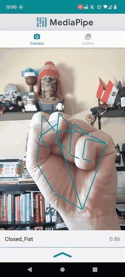
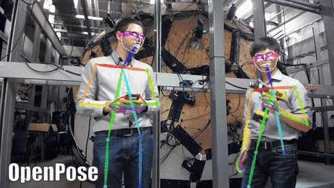
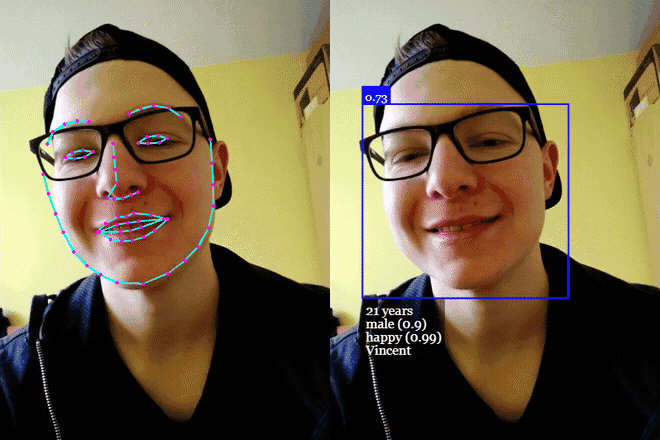
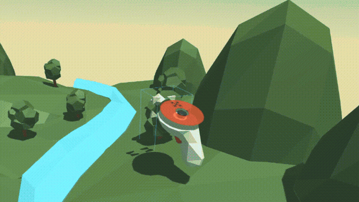
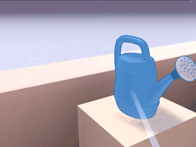
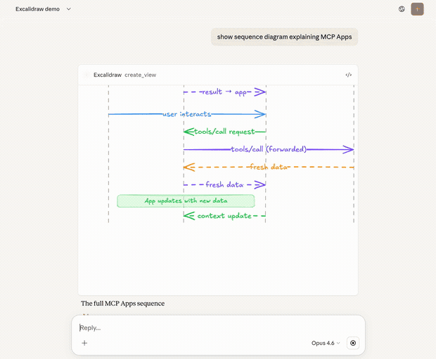
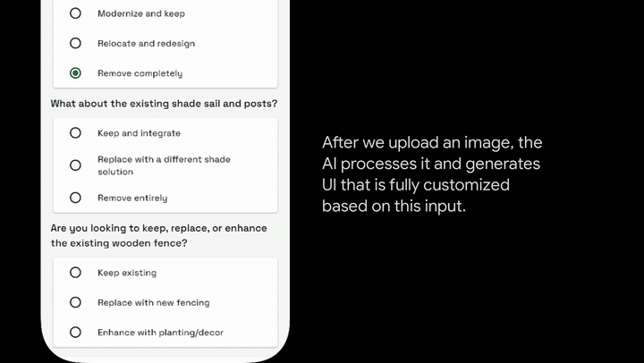
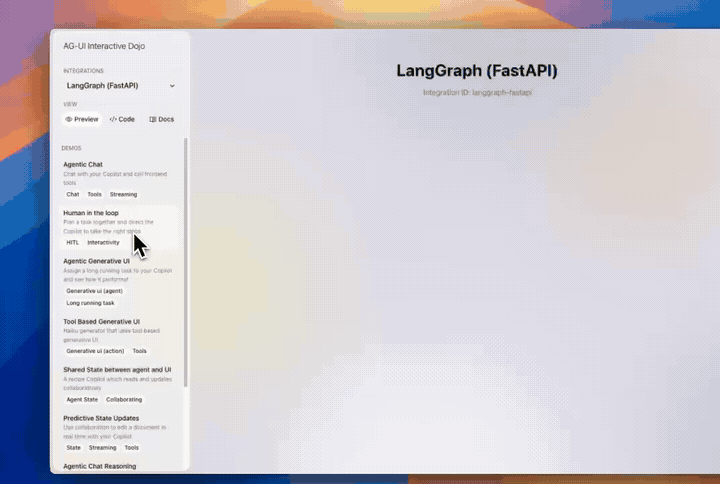
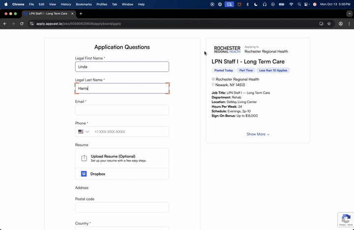

# Awesome Interaction

一个以动图为索引的开源交互方式图鉴。这里关注的是人与软件之间不同的**输入—反馈循环**，而不只是 UI 组件的外观。

> 每个条目都包含项目链接、简短介绍和由项目演示素材截取的 GIF。点击项目名可前往原仓库。

## 收录标准

1. **先按交互方式去重**：如果两个项目的主要输入、用户意图和反馈循环基本相同，则视为同一种交互方式。
2. **重复时优先 star 最高者**：主列表只保留代表性最高的项目；其他实现不重复展示。
3. **主列表门槛为 100 stars**：低于 100 stars 但原型可运行、交互思路独特且有清晰演示的项目进入 [Backup](#backup)。
4. **必须能看见交互**：没有公开演示素材、无法判断实际交互过程的项目暂不收录。
5. **stars 是快照**：数量会随时间变化，README 中记录核验日期，不作为质量的永久结论。

### 简单评分（10 分）

| 维度 | 分值 | 判断方式 |
| --- | ---: | --- |
| 社区采用 | 0–5 | 100+ / 1k+ / 5k+ / 10k+ / 50k+ stars 分别为 1–5 分 |
| 演示质量 | 0–2 | 有截图 1 分；有完整视频或可操作 demo 2 分 |
| 活跃度 | 0–2 | 24 个月内有更新 1 分；12 个月内有更新 2 分 |
| 可复现性 | 0–1 | 有清晰安装步骤或可直接运行示例得 1 分 |

> 去重时首先比较 stars；评分用于判断低 star 项目是否仍值得进入 Backup，以及帮助读者估计上手成本。

## Interaction Atlas

### Gesture Recognition · 手势识别

#### [MediaPipe](https://github.com/google-ai-edge/mediapipe) · ★ 36,106 · 9/10

通过普通摄像头实时识别手部关键点与手势，把捏合、握拳、指向等身体动作变成无需触屏的输入。MediaPipe 提供跨平台视觉管线；这里使用其官方 samples 中的 Android Gesture Recognizer 展示“手势—分类—置信度”的即时反馈。

*Stars 核验：2026-07-15 · [演示素材来源](https://github.com/google-ai-edge/mediapipe-samples)*

### Full-body Pose · 全身姿态

#### [OpenPose](https://github.com/CMU-Perceptual-Computing-Lab/openpose) · ★ 34,284 · 8/10

把摄像头中的多人身体、手部、面部和足部关键点实时映射为骨骼，让站立、转身、抬手和舞蹈等完整身体动作成为控制信号。它代表的是“以身体为控制器”，与只分类单个手势的 MediaPipe 条目不同。

*Stars 核验：2026-07-15 · [原始演示素材](https://github.com/CMU-Perceptual-Computing-Lab/openpose/blob/master/.github/media/pose_face_hands.gif)*

### Facial State · 面部状态

#### [face-api.js](https://github.com/justadudewhohacks/face-api.js) · ★ 17,904 · 7/10

在浏览器中同时进行人脸检测、关键点、身份特征、年龄、性别和表情估计，使微笑、惊讶或注意状态能够改变界面反馈。这个模式的核心不是点击，而是系统持续感知用户的面部状态。

*Stars 核验：2026-07-15 · [原始演示素材](https://github.com/justadudewhohacks/face-api.js)*

### Immersive WebXR · 沉浸式空间

#### [A-Frame](https://github.com/aframevr/aframe) · ★ 17,586 · 9/10

用 HTML 式声明构建可在浏览器和头显中进入的 3D 场景，用户通过头部朝向、空间移动和控制器与环境交互。它把网页从二维页面扩展成可进入、可环顾的空间界面。

*Stars 核验：2026-07-15 · [原始演示素材](https://github.com/aframevr/aframe)*

### XR Direct Manipulation · XR 直接操纵

#### [XR Interaction Toolkit Examples](https://github.com/Unity-Technologies/XR-Interaction-Toolkit-Examples) · ★ 1,299 · 7/10

Unity 官方示例把“抓取、移动、倾倒、激活”等现实动作映射到虚拟物体，并同时提供近距离手部操作与远距离射线操作。与进入 3D 空间本身相比，这里关注的是用户如何像拿真实物体一样操作数字对象。

*Stars 核验：2026-07-15 · [原始演示素材](https://github.com/Unity-Technologies/XR-Interaction-Toolkit-Examples/blob/main/Documentation/Images/Station-02-grab-interactables-01.gif)*

### Embedded AI App · 对话内嵌应用

#### [MCP Apps](https://github.com/modelcontextprotocol/ext-apps) · ★ 2,573 · 7/10

让 MCP 工具在 AI 对话中返回一个真正可操作的应用，而不只是文字或静态卡片。用户可以直接在消息流里编辑 Excalidraw、操作地图或图表；应用状态和工具调用再回到 Agent，形成持续的双向循环。

*Stars 核验：2026-07-15 · [原始演示素材](https://github.com/modelcontextprotocol/ext-apps/blob/main/media/excalidraw.gif)*

### Declarative Generative UI · 声明式生成界面

#### [A2UI](https://github.com/a2ui-project/a2ui) · ★ 15,745 · 9/10

Agent 不执行任意前端代码，而是输出可增量更新的声明式组件树，由宿主应用映射为受信任的原生控件。演示中的表单会根据上传图片和前序选择继续生成，让界面随任务语境逐步长出来。

*Stars 核验：2026-07-15 · [原始演示素材](https://github.com/a2ui-project/a2ui/blob/main/docs/public/assets/landscape-architect-demo.mp4)*

### Agent–User Shared State · 双向协作状态

#### [AG-UI](https://github.com/ag-ui-protocol/ag-ui) · ★ 14,741 · 9/10

通过事件协议把 Agent 的流式输出、工具调用、前端状态和用户修改放进同一个双向通道。人可以在运行中的任务里编辑、批准或接管，Agent 也能持续看见界面状态，而不是一问一答后彼此失忆。

*Stars 核验：2026-07-15 · [原始演示素材](https://github.com/ag-ui-protocol/ag-ui/blob/main/docs/videos/Dojo-overview.mp4)*

### GUI Delegation · 图形界面代操作

#### [browser-use](https://github.com/browser-use/browser-use) · ★ 104,776 · 10/10

用户用自然语言描述目标，Agent 再观察网页、点击、输入、滚动和提交表单。交互从“人逐个操作控件”变成“人表达意图并监督执行轨迹”，界面同时承担环境、反馈和可接管控制面的角色。

*Stars 核验：2026-07-15 · [原始演示素材](https://github.com/browser-use/browser-use)*

## Backup

低于 100 stars、但交互思路可行且有演示证据的实验性项目会放在这里。

## GIF 制作说明

- GIF 均从对应项目公开的演示视频或动态图中截取短片段，统一缩放和降帧后保存于 [`demo/gifs`](demo/gifs)。
- 原始视频、转码缓存、测试页面和验证截图只保存在被忽略的 `tmp/` 目录，不上传 GitHub。
- GIF 仅用于索引和说明原项目的交互方式；项目名称、代码和原始演示素材的权利归各自作者。

## Demo

打开 [`demo/index.html`](demo/index.html) 可以用卡片形式浏览同一份交互图鉴。
