# Awesome Web Effects

一个用短 GIF 浏览开源 **Web 页面视觉效果** 的图鉴。新版不再覆盖所有人机交互方式，只研究效果如何出现在网页里：滚动、页面转场、布局变化、指针响应、3D、Canvas / WebGL、SVG 与媒体展示。

> 项目名会跳转到原 GitHub 仓库；每个条目最终都包含效果说明、stars 快照、简单评分、GIF 与素材来源。

## 这次聚焦什么

| 方向 | 关注的问题 | 典型效果 |
| --- | --- | --- |
| Scroll | 滚动如何成为动画时间轴 | 惯性滚动、滚动擦洗、滚动叙事、进入动效 |
| Transition | 页面和布局如何连续变化 | 页面转场、共享布局、筛选重排、触摸轮播 |
| Pointer | 指针如何直接改变画面 | 视差、倾斜、跟随光标、悬停扭曲、拖拽揭示 |
| Canvas / WebGL | 实时图形如何成为页面主体 | 3D 场景、流体、粒子、Shader 转场 |
| Vector / Media | 内容本身如何动起来 | SVG 描边、矢量动画、灯箱缩放 |

不再收录：语音输入、脑机接口、终端 UI、XR、Agent 协议、设备控制、数据分析工作流等与“页面视觉效果”不直接相关的项目。

## 收录标准

1. **必须在网页中看见效果**：仓库需提供官方动态演示、在线 demo，或足够清晰的最小复现方式。
2. **按视觉结果去重**：使用“触发方式 + 视觉变化 + 时间关系 + 页面层级”作为去重签名。实现技术不同但最终效果基本相同，只保留一个代表。
3. **重复时优先 stars 最高者**：同类项目先比较 stars；若高 stars 项目没有可见 demo，则保留能完整展示效果的候选。
4. **主列表门槛为 100 stars**：低于 100 stars 但效果独特、可运行且演示清楚的项目进入 Backup。
5. **GIF 必须真的展示变化**：不使用 Logo、静态截图或宣传封面冒充效果。优先截取官方动态素材；没有合适官方 GIF 时，提供统一尺寸的编辑演示并明确标注。
6. **stars 是快照**：本轮统一核验于 2026-07-15，数量会随时间变化。

### 简单评分（10 分）

| 维度 | 分值 | 判断方式 |
| --- | ---: | --- |
| 视觉辨识度 | 0–3 | 是否一眼能看出效果，以及变化是否适合页面表达 |
| 社区采用 | 0–3 | 100+ / 1k+ / 10k+ stars 分别为 1–3 分 |
| 活跃度 | 0–2 | 24 个月内更新 1 分；12 个月内更新 2 分 |
| 演示完整度 | 0–2 | 有动态素材 1 分；另有在线或可运行 demo 2 分 |

## Web Effect Atlas

### Scroll · 滚动

#### 01 · [Lenis](https://github.com/darkroomengineering/lenis) — 惯性平滑滚动

**★ 14,370 · 10/10 · Official capture**

把滚轮和触摸位移变成带惯性、阻尼和插值的连续运动，让长页面滚动更有重量，同时保持页面结构与原生滚动语义。

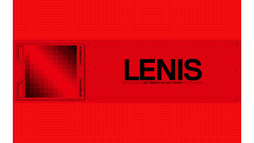

*Inertial Smooth Scroll · 更新：2026-06-30 · [GIF 来源](https://assets.darkroom.engineering/lenis/banner.gif)*

#### 02 · [GSAP](https://github.com/greensock/GSAP) — 滚动擦洗时间线

**★ 26,595 · 10/10 · Editorial demo**

把页面滚动进度直接绑定到动画时间轴，可实现 pin、scrub、snap 与多段编排；用户前后滚动时，画面也可逆地前进或倒放。

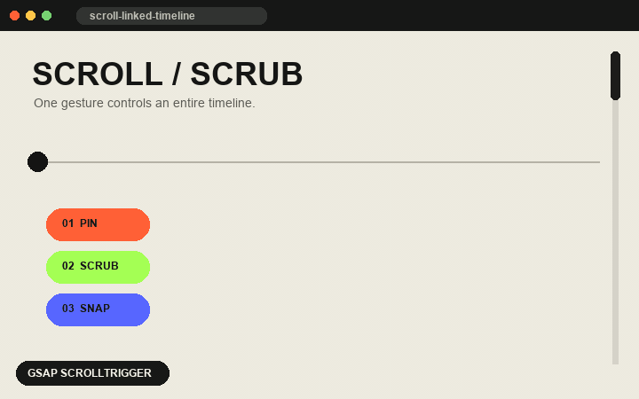

*Scroll-scrubbed Timeline · 更新：2026-04-13 · [效果参考](https://gsap.com/scrolltrigger/)*

#### 03 · [Scrollama](https://github.com/russellsamora/scrollama) — 固定画布滚动叙事

**★ 5,985 · 8/10 · Official capture**

文字步骤向上经过视口时，固定图形切换状态。滚动既控制阅读节奏，也成为数据叙事的离散时间轴。

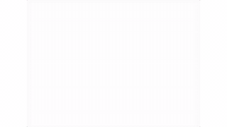

*Pinned Scrollytelling · 更新：2025-11-13 · [GIF 来源](https://pudding.cool/process/how-to-implement-scrollytelling/)*

#### 04 · [AOS](https://github.com/michalsnik/aos) — 进入视口动效

**★ 28,069 · 7/10 · Editorial demo**

元素进入视口时执行淡入、位移、缩放或翻转，用极小配置给内容建立逐段出现的阅读节奏。

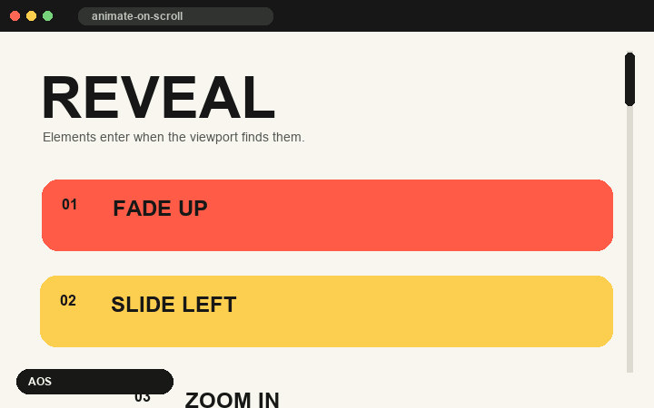

*Viewport Reveal · 更新：2024-03-26 · [效果参考](https://michalsnik.github.io/aos/)*

### Transition · 转场与布局

#### 05 · [Barba.js](https://github.com/barbajs/barba) — 无刷新页面转场

**★ 12,948 · 9/10 · Editorial demo**

在旧页面离场与新页面进场之间插入可编排过渡，保留外壳并替换内容，消除传统导航时的白屏和断裂感。

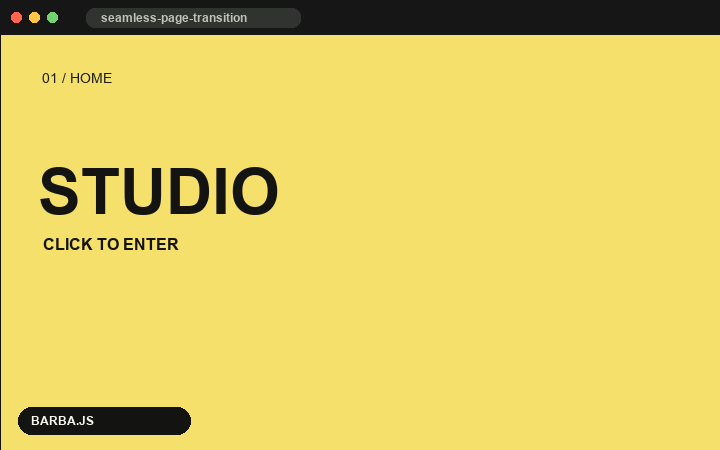

*Seamless Page Transition · 更新：2024-12-02 · [效果参考](https://barba.js.org/)*

#### 06 · [Motion](https://github.com/motiondivision/motion) — 共享布局变形

**★ 32,818 · 10/10 · Editorial demo**

同一元素在网格、列表、弹层等布局间切换时，以 spring 连续插值位置、尺寸和圆角，让状态变化看起来像同一个对象在移动。

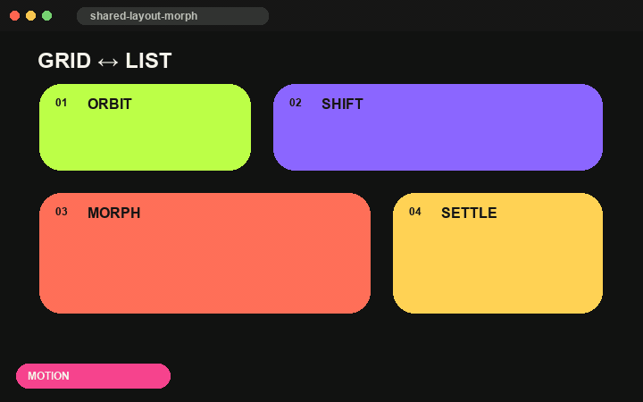

*Shared Layout Morph · 更新：2026-07-01 · [效果参考](https://motion.dev/docs)*

#### 07 · [Isotope](https://github.com/metafizzy/isotope) — 筛选网格重排

**★ 11,103 · 7/10 · Editorial demo**

筛选或排序后，保留项目平滑移动到新位置，被移除项目缩小离场；用户始终能追踪内容从旧布局到新布局的关系。

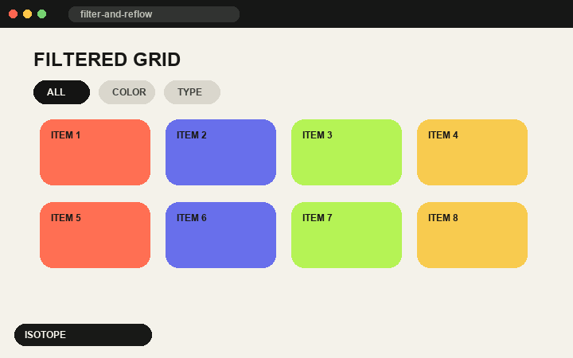

*Filtered Grid Reflow · 更新：2021-09-24 · [效果参考](https://isotope.metafizzy.co/)*

#### 08 · [Swiper](https://github.com/nolimits4web/swiper) — 惯性触摸轮播

**★ 41,870 · 9/10 · Editorial demo**

拖动或滑动卡片后保留速度并吸附到下一项，可组合 coverflow、层叠和缩放，形成移动端熟悉的直接操纵反馈。

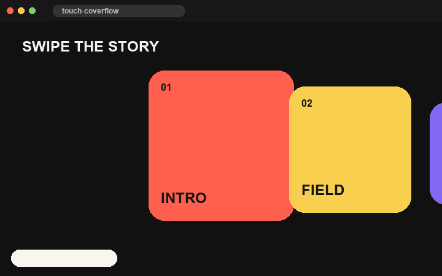

*Momentum Touch Carousel · 更新：2026-07-13 · [效果参考](https://swiperjs.com/demos)*

### Pointer · 指针响应

#### 09 · [Parallax.js](https://github.com/wagerfield/parallax) — 指针景深视差

**★ 16,583 · 7/10 · Editorial demo**

根据指针或设备方向让前景、中景和背景以不同速度移动，用二维图层制造可立即感知的空间深度。

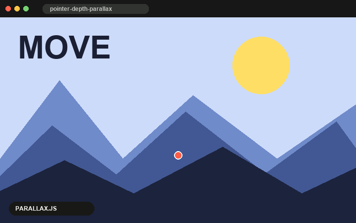

*Pointer Depth Parallax · 更新：2024-04-06 · [效果参考](http://wagerfield.github.io/parallax/)*

#### 10 · [vanilla-tilt.js](https://github.com/micku7zu/vanilla-tilt.js) — 透视倾斜与高光

**★ 4,019 · 6/10 · Editorial demo**

卡片朝指针方向进行 3D 透视旋转，并叠加随角度移动的高光，适合商品、封面和强调型卡片。

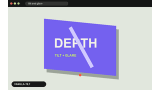

*Perspective Tilt & Glare · 更新：2024-03-01 · [效果参考](https://micku7zu.github.io/vanilla-tilt.js/)*

#### 11 · [mouse-follower](https://github.com/Cuberto/mouse-follower) — 情境化跟随光标

**★ 818 · 6/10 · Official capture**

光标不只指向位置，还会在不同元素上改变尺寸、颜色、文字、图片或视频内容，成为随上下文变化的提示层。

*Contextual Cursor · 更新：2023-10-23 · [GIF 来源](https://user-images.githubusercontent.com/11841379/162477170-5dd33ecd-0e72-4fe4-9053-53d7b5557637.gif)*

#### 12 · [hover-effect](https://github.com/robin-dela/hover-effect) — 位移贴图悬停扭曲

**★ 1,874 · 7/10 · Official capture**

用 WebGL 位移贴图在两张图片之间制造液化、褶皱或噪声式过渡，让普通缩略图在悬停时出现具有材质感的变化。

*Displacement Image Hover · 更新：2023-06-27 · [GIF 来源](https://github.com/robin-dela/hover-effect/blob/master/gifs/alex_brown.gif)*

#### 13 · [img-comparison-slider](https://github.com/sneas/img-comparison-slider) — 拖拽前后对比

**★ 864 · 7/10 · Official capture**

用户拖动分隔手柄，直接控制两张重叠图片的可见比例；特别适合展示修复、设计改版和处理前后的差异。

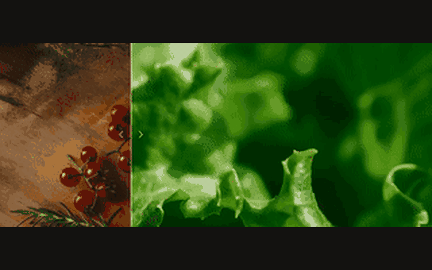

*Drag-to-Reveal Comparison · 更新：2026-05-25 · [GIF 来源](https://github.com/sneas/img-comparison-slider/blob/master/docs/example.gif)*

### Canvas / WebGL · 实时图形

#### 14 · [react-three-fiber](https://github.com/pmndrs/react-three-fiber) — 交互式 3D 场景

**★ 31,432 · 10/10 · Official capture**

用声明式组件组织 Three.js 场景、灯光、材质和交互，把可旋转、可点击、可响应状态的实时 3D 内容嵌入普通网页。

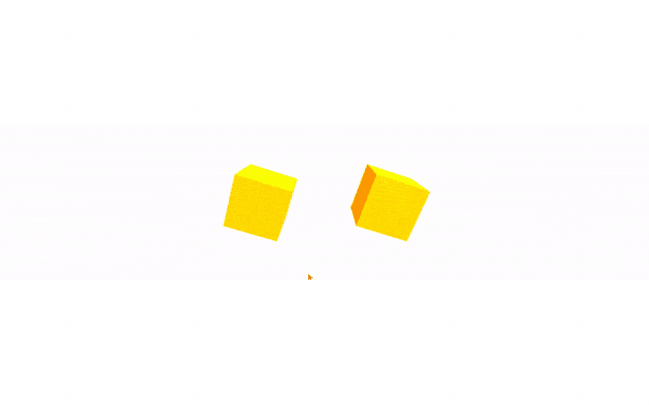

*Interactive 3D Scene · 更新：2026-07-08 · [GIF 来源](https://github.com/pmndrs/react-three-fiber/blob/master/docs/basic-app.gif)*

#### 15 · [WebGL Fluid Simulation](https://github.com/PavelDoGreat/WebGL-Fluid-Simulation) — 指针驱动流体

**★ 16,488 · 9/10 · Editorial demo**

指针移动向 GPU 流体模拟注入速度和颜色，拖出会扩散、旋转和混合的光迹，使整块背景成为连续响应的画布。

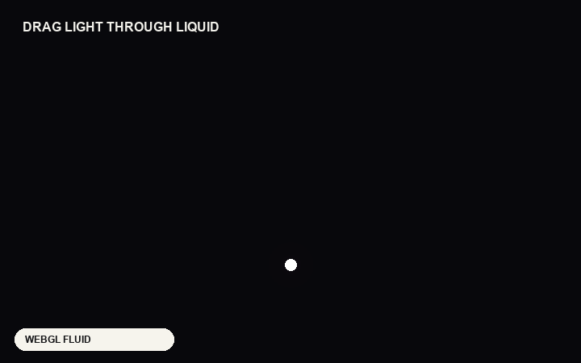

*Cursor-driven Fluid · 更新：2024-11-12 · [效果参考](https://paveldogreat.github.io/WebGL-Fluid-Simulation/)*

#### 16 · [tsParticles](https://github.com/tsparticles/tsparticles) — 响应式粒子场

**★ 8,922 · 9/10 · Official capture**

大量粒子在 Canvas 中漂浮、连线、碰撞或被指针吸引和排斥，可作为背景环境，也可触发烟花、雪花与 confetti。

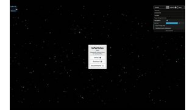

*Reactive Particle Field · 更新：2026-07-14 · [GIF 来源](https://github.com/tsparticles/tsparticles/blob/main/demo/vanilla/public/images/gifs/connect.gif)*

#### 17 · [GL Transitions](https://github.com/gl-transitions/gl-transitions) — Shader 媒体转场

**★ 2,115 · 9/10 · Editorial demo**

用可复用的 GLSL 片段着色器在图片或视频之间做波纹、溶解、扭曲和几何擦除，比普通淡入淡出拥有更强的材质特征。

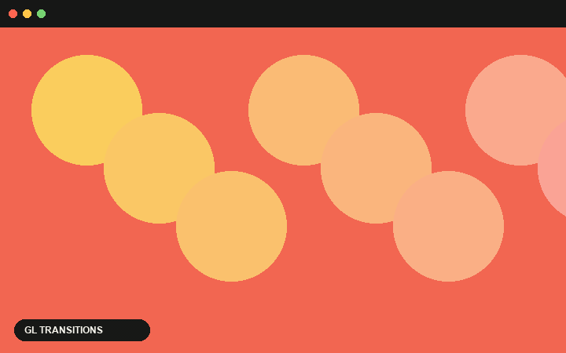

*Shader Media Transition · 更新：2026-06-22 · [效果参考](https://gl-transitions.com/)*

### Vector / Media · 矢量与媒体

#### 18 · [Vivus](https://github.com/maxwellito/vivus) — SVG 描边绘制

**★ 15,480 · 7/10 · Editorial demo**

逐步改变 SVG path 的描边偏移，让图标、字标或插画像被一笔一笔画出；动画仍保持矢量的清晰与可缩放。

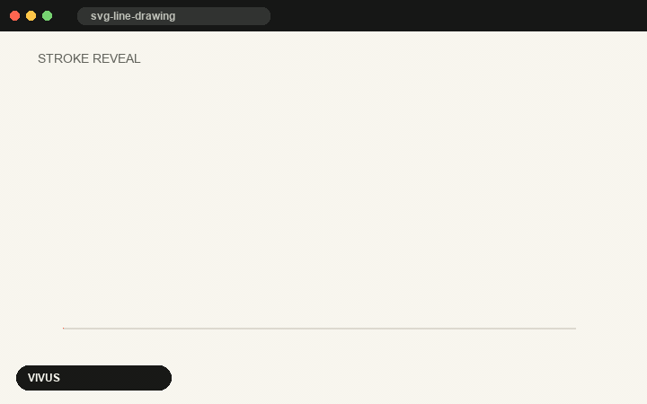

*SVG Line Drawing · 更新：2022-07-06 · [效果参考](https://github.com/maxwellito/vivus#principles)*

#### 19 · [lottie-web](https://github.com/airbnb/lottie-web) — 矢量插画动画

**★ 32,013 · 9/10 · Official capture**

把 After Effects 导出的 JSON 动画渲染为 SVG、Canvas 或 HTML，使图标和插画保持轻量、清晰，并可由页面状态精确控制。

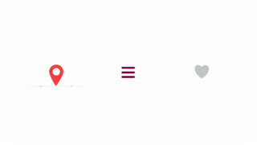

*Vector Illustration Motion · 更新：2025-09-01 · [GIF 来源](https://github.com/airbnb/lottie-web/blob/master/gifs/Example1.gif)*

#### 20 · [PhotoSwipe](https://github.com/dimsemenov/PhotoSwipe) — 缩略图灯箱缩放

**★ 25,215 · 9/10 · Editorial demo**

缩略图从原位置连续放大到沉浸式灯箱，并支持拖拽、缩放和切换；关闭时再回到来源位置，保持空间关系。

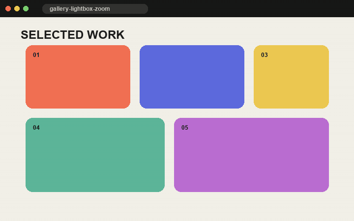

*Thumbnail-to-Lightbox Zoom · 更新：2025-12-04 · [效果参考](https://photoswipe.com/getting-started/)*

## Backup

本轮没有低于 100 stars 且必须保留的独特效果候选；后续发现符合“效果独特 + 可运行 + 动态演示清楚”的项目时，会加入这里而不降低主列表门槛。

## GIF 说明

- **Official capture**：来自项目仓库、官方文档或官方 demo 的动态素材，统一裁切为 720 × 450、6 秒。
- **Editorial demo**：依据项目所代表的效果制作的最小视觉复现，用于让不同效果在相同画幅中可比较；它不冒充项目原 UI。
- 素材仅用于研究、索引和比较，版权归原作者所有。
