<div align="center">

# Awesome Web Effects

**اثر کو مقدم رکھنے والا تعاملی اٹلس**

صرف وہ Demo شائع ہوتے ہیں جو بصری جانچ میں 80 یا زیادہ اسکور کریں؛ ہر ایک کے ساتھ حقیقی preview، کم سے کم code اور implementation prompt ہوتا ہے۔

[](https://giraffe-tree.github.io/awesome-web-effects/)
[](https://giraffe-tree.github.io/awesome-web-effects/)
[](https://github.com/giraffe-tree/awesome-web-effects/stargazers)

[**اثرات دیکھیں →**](https://giraffe-tree.github.io/awesome-web-effects/?lang=ur) · [Language metadata / 语言资料](docs/LANGUAGES.md)

<sub>[English](README.md) · [简体中文](README.zh-Hans.md) · [हिन्दी](README.hi.md) · [Español](README.es.md) · [العربية](README.ar.md) · [Français](README.fr.md) · [বাংলা](README.bn.md) · [Português](README.pt.md) · [Bahasa Indonesia](README.id.md) · [اردو](README.ur.md) · [Русский](README.ru.md) · [Deutsch](README.de.md) · [日本語](README.ja.md) · [Naijá](README.pcm.md) · [العربي المصري](README.arz.md) · [मराठी](README.mr.md) · [Tiếng Việt](README.vi.md) · [తెలుగు](README.te.md) · [Kiswahili](README.sw.md) · [Hausa](README.ha.md)</sub>

</div>

---

<h3 align="center">15 تصدیق شدہ GIF / 151 اثرات</h3>

<table>
<tr>
<td width="33%" align="center">
<a href="https://giraffe-tree.github.io/awesome-web-effects/?lang=ur#connected-fragment-story-stage">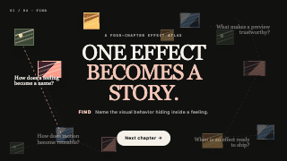</a>
<br>
<sub><strong>Connected fragment story stage</strong><br>Motion &amp; choreography · 95/100</sub>
</td>
<td width="33%" align="center">
<a href="https://giraffe-tree.github.io/awesome-web-effects/?lang=ur#pinned-horizontal-scroll-scene">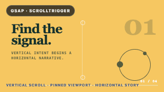</a>
<br>
<sub><strong>Pinned horizontal scroll scene</strong><br>Scroll &amp; reveal · 96/100</sub>
</td>
<td width="33%" align="center">
<a href="https://giraffe-tree.github.io/awesome-web-effects/?lang=ur#prompt-select-replace-loop">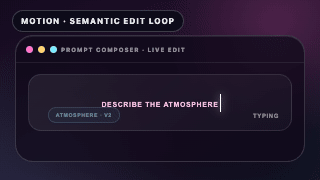</a>
<br>
<sub><strong>Semantic prompt revision workspace</strong><br>Text &amp; SVG · 100/100</sub>
</td>
</tr>
<tr>
<td width="33%" align="center">
<a href="https://giraffe-tree.github.io/awesome-web-effects/?lang=ur#staggered-transform-choreography">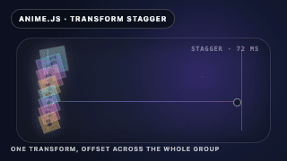</a>
<br>
<sub><strong>Staggered transform choreography</strong><br>Motion &amp; choreography · 92/100</sub>
</td>
<td width="33%" align="center">
<a href="https://giraffe-tree.github.io/awesome-web-effects/?lang=ur#motion-graphics-burst"></a>
<br>
<sub><strong>Motion-graphics burst</strong><br>Motion &amp; choreography · 92/100</sub>
</td>
<td width="33%" align="center">
<a href="https://giraffe-tree.github.io/awesome-web-effects/?lang=ur#visually-authored-keyframe-sequence">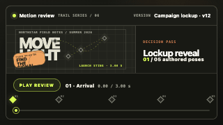</a>
<br>
<sub><strong>Visually authored keyframe sequence</strong><br>Motion &amp; choreography · 84/100</sub>
</td>
</tr>
<tr>
<td width="33%" align="center">
<a href="https://giraffe-tree.github.io/awesome-web-effects/?lang=ur#compact-svg-shape-tween">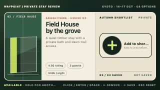</a>
<br>
<sub><strong>Compact SVG shape tween</strong><br>Motion &amp; choreography · 89/100</sub>
</td>
<td width="33%" align="center">
<a href="https://giraffe-tree.github.io/awesome-web-effects/?lang=ur#filterable-grid-reflow">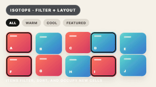</a>
<br>
<sub><strong>Filterable grid reflow</strong><br>Page &amp; layout · 85/100</sub>
</td>
<td width="33%" align="center">
<a href="https://giraffe-tree.github.io/awesome-web-effects/?lang=ur#perspective-tilt-and-glare">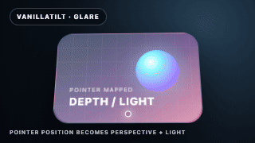</a>
<br>
<sub><strong>Perspective tilt and glare</strong><br>Pointer &amp; hover · 90/100</sub>
</td>
</tr>
<tr>
<td width="33%" align="center">
<a href="https://giraffe-tree.github.io/awesome-web-effects/?lang=ur#context-aware-custom-cursor">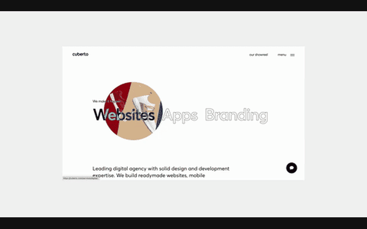</a>
<br>
<sub><strong>Context-aware custom cursor</strong><br>Pointer &amp; hover · 86/100</sub>
</td>
<td width="33%" align="center">
<a href="https://giraffe-tree.github.io/awesome-web-effects/?lang=ur#displacement-map-image-hover"></a>
<br>
<sub><strong>Displacement-map image hover</strong><br>Pointer &amp; hover · 90/100</sub>
</td>
<td width="33%" align="center">
<a href="https://giraffe-tree.github.io/awesome-web-effects/?lang=ur#svg-stroke-drawing">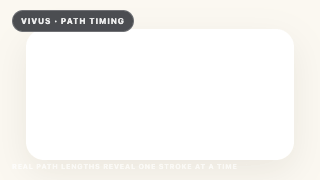</a>
<br>
<sub><strong>SVG stroke drawing</strong><br>Text &amp; SVG · 86/100</sub>
</td>
</tr>
<tr>
<td width="33%" align="center">
<a href="https://giraffe-tree.github.io/awesome-web-effects/?lang=ur#dom-aware-drag-spawned-fish-flock"></a>
<br>
<sub><strong>Human-released DOM-avoiding fish school</strong><br>Canvas &amp; 2D · 100/100</sub>
</td>
<td width="33%" align="center">
<a href="https://giraffe-tree.github.io/awesome-web-effects/?lang=ur#pointer-injected-gpu-fluid"></a>
<br>
<sub><strong>Stage haze colour lab</strong><br>3D &amp; WebGL · 99/100</sub>
</td>
<td width="33%" align="center">
<a href="https://giraffe-tree.github.io/awesome-web-effects/?lang=ur#dom-synced-shader-planes">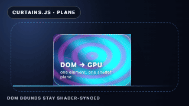</a>
<br>
<sub><strong>Human-calibrated DOM / GPU media registration</strong><br>3D &amp; WebGL · 100/100</sub>
</td>
</tr>
</table>

<a id="agent-quick-start"></a>

## اسے اپنے coding agent کے سپرد کریں۔

ایک کلک accessibility، responsive رویے، cleanup اور reduced motion کی شرائط والا محدود prompt نقل کرتا ہے۔

```text
Review the current project using https://giraffe-tree.github.io/awesome-web-effects/ as read-only inspiration. Pick one effect suited to the product and stack. Inspect its verified demo and minimal code; define 2–3 observable acceptance criteria, then adapt it with original assets, preserving responsive, keyboard, pointer, touch, prefers-reduced-motion, performance, and cleanup. Run tests and desktop/mobile browser checks. Report the effect URL, changed files, evidence per criterion, and remaining risks.
```

<p align="center"><a href="https://giraffe-tree.github.io/awesome-web-effects/?lang=ur#agent-prompt"><strong>Agent prompt نقل کریں →</strong></a></p>

## تعاملی کیٹلاگ

پہلے رویہ منتخب کریں، پھر اوزار۔

<table>
<tr>
<td width="25%" align="center"><strong>151</strong><br><sub>اثرات</sub></td>
<td width="25%" align="center"><strong>151</strong><br><sub>تصدیق شدہ GIF</sub></td>
<td width="25%" align="center"><strong>149</strong><br><sub>مقامی Demo</sub></td>
<td width="25%" align="center"><strong>80/100</strong><br><sub>کیوریٹوریل داخلہ اسکور</sub></td>
</tr>
</table>

<table>
<tr>
<td width="33%"><strong>بنانے سے پہلے اصل Demo دیکھیں۔</strong><br><sub>ہر شائع شدہ اندراج نے تخلیق، art direction، motion، وضاحت، ترغیب اور ثبوت کی 100 نکاتی جانچ پاس کی ہے۔</sub></td>
<td width="33%"><strong>چلنے والے code سے شروع کریں۔</strong><br><sub>کسی بھی اثر کو کھول کر اس کے تجویز کردہ ماخذ کا سب سے چھوٹا مفید implementation نقل کریں۔</sub></td>
<td width="33%"><strong>اسے اپنے coding agent کے سپرد کریں۔</strong><br><sub>ایک کلک accessibility، responsive رویے، cleanup اور reduced motion کی شرائط والا محدود prompt نقل کرتا ہے۔</sub></td>
</tr>
</table>

## چلنے والے code سے شروع کریں۔

کسی بھی اثر کو کھول کر اس کے تجویز کردہ ماخذ کا سب سے چھوٹا مفید implementation نقل کریں۔

```bash
python3 -m http.server 4173 --directory demo
```

- [اثرات دیکھیں](https://giraffe-tree.github.io/awesome-web-effects/?lang=ur)
- [ریپوزٹری دیکھیں](https://github.com/giraffe-tree/awesome-web-effects)
- [تحقیقی حوالہ کھولیں ↗](README.md)
- [Language metadata / 语言资料](docs/LANGUAGES.md)

---

<p align="center"><sub>اثر کو مقدم، کثیر لسانی اور implementation کے لیے تیار۔ پروجیکٹ نام اور previews اپنے مصنفین کی ملکیت ہیں۔</sub></p>
