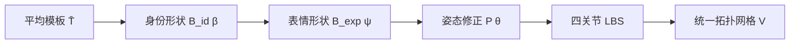

# Google GNM Head 原理总结

## 1. 一句话理解

GNM（Generative aNthropometric Model，读音类似 *genome*）不是一个“根据文字画人脸”的生成模型，而是一个**用少量参数计算稠密三维人头网格的统计几何模型**。

它把一个人的头部几何拆成平均模板、身份差异、表情变化、骨骼姿态和全局位移，再把这些因素组合成拓扑始终一致的三维网格。

## 2. Google 开源了什么

GNM Head 是 GNM 生态首先开放的模型，采用 Apache 2.0 许可证，主要包含：

- 高密度人头、面部和内部口腔几何；
- 相互分离的身份、表情、头部姿态、眼球姿态和位移参数；
- 皮肤、双眼、上下牙齿与牙龈、舌头等完整组件；
- NumPy、JAX、PyTorch、TensorFlow 四种后端实现；
- 根据语义标签采样身份与表情参数的预训练解码器；
- UV、三角形和四边形拓扑、骨骼、蒙皮权重及姿态修正数据。

这意味着开发者拿到的不是一个封闭渲染器，而是一套可以批量计算、优化、求梯度并嵌入训练流程的参数化几何底座。

## 3. 核心公式

GNM Head 可以概括为：

$$
V = W\left(\bar{T} + B_{id}\beta + B_{exp}\psi + P(\theta),\ J(\beta),\ \theta\right) + t
$$

| 符号 | 含义 |
| --- | --- |
| $\bar{T}$ | 所有人共享的平均人头模板 |
| $B_{id}$ | 身份形状基底，每个方向描述一类稳定的个体差异 |
| $\beta$ | 身份系数，决定各身份基底叠加多少 |
| $B_{exp}$ | 表情基底，描述眼睑、嘴部、面颊、舌头等区域的运动 |
| $\psi$ | 表情系数 |
| $J(\beta)$ | 随身份形状变化的关节位置 |
| $\theta$ | 颈部、头部和双眼球的轴角旋转参数 |
| $P(\theta)$ | 姿态修正项，用于补偿普通蒙皮产生的非自然变形 |
| $W(\cdot)$ | 线性混合蒙皮（Linear Blend Skinning，LBS） |
| $t$ | 全局平移 |
| $V$ | 最终输出的三维顶点 |

## 4. 五步计算过程



### 4.1 平均模板

模型先定义一张平均人头网格。所有生成结果共享它的顶点编号、面片连接和 UV 布局，因此同一顶点在不同身份和表情中始终表示相应的局部位置。

### 4.2 身份空间

身份参数 $\beta$ 控制“这个人是谁”。GNM Head v3 使用 253 个身份维度：

- 170 个头部维度；
- 3 个眼球维度；
- 80 个牙齿维度。

每个身份维度都是覆盖整个模型的一组顶点位移，而不是单独拉动某个控制点。身份还会影响关节位置 $J(\beta)$，避免不同头型共用完全相同的骨架位置。

### 4.3 表情空间

表情参数 $\psi$ 控制“这个人正在做什么表情”。GNM Head v3 使用 383 个表情维度：

- 左眼 100 个；
- 右眼 100 个；
- 下半脸 150 个；
- 舌头 32 个；
- 虹膜 1 个。

身份和表情在绑定姿态中线性叠加，因此同一表情可以应用到不同身份上，并保持统一拓扑。

### 4.4 姿态修正与骨骼

模型包含四个关节：`neck → head → left_eye/right_eye`。

旋转参数先驱动这套关节层级。随后，姿态修正项 $P(\theta)$ 根据关节旋转补偿颈部、眼眶等区域的非刚性形变；LBS 再按照每个顶点的蒙皮权重，把关节变换传播到整个网格。

### 4.5 输出网格

无论身份、表情和姿态如何变化，顶点数量和连接关系都不变。这种一一对应关系是 GNM 最有价值的特性之一，使下面这些数据可以稳定传递：

- UV 和纹理；
- 动画与蒙皮权重；
- 三维监督信号和关键点；
- 不同身份之间的局部编辑；
- 神经渲染或拟合过程中的梯度。

## 5. GNM Head v3 数据规模

| 项目 | 数值 |
| --- | ---: |
| 顶点 | 17,821 |
| 三角面 | 35,324 |
| 四边形 | 17,662 |
| 身份维度 | 253 |
| 表情维度 | 383 |
| 骨骼关节 | 4 |
| 几何组件 | 6 |

六个几何组件分别是皮肤与头部、左眼球、右眼球、上牙与牙龈、下牙与牙龈、舌头。

## 6. 为什么它可以“正向生成”也可以“反向拟合”

正向使用时，给定 $\beta$、$\psi$、$\theta$ 和 $t$，GNM 直接计算出网格 $V$。

反向使用时，可以定义网格投影与照片、视频或扫描之间的误差，再通过 JAX、PyTorch 或 TensorFlow 的自动微分优化参数。于是，同一个模型函数既能合成训练数据，也能成为人脸重建和跟踪系统中的可优化先验。

需要注意，GNM 官方仓库提供的是参数化模型和拟合辅助能力，不是一个输入单张照片就能直接输出完整数字人的端到端产品。

## 7. 适合与不适合的场景

### 适合

- 拓扑一致的人头合成与动画；
- 人脸、眼球和口腔几何拟合；
- 可控合成数据生成；
- 神经渲染、头像与数字人系统的几何先验；
- 跨身份传递表情、纹理、关键点和局部编辑；
- 研究可微人头模型和三维统计形状空间。

### 不直接提供

- 头发、服装和完整人体；
- 毛孔、皮肤材质和照片级着色；
- 单目图像开箱即用的重建网络；
- 制作级动画界面或 DCC 插件；
- 对所有身份群体都无偏的统计空间。

## 8. 数据与公平性边界

官方说明当前模型训练数据沿用了二元性别类别和四个宽泛人口类别。这些标签不能完整表达真实世界中的性别身份和全球人口多样性。

因此，在身份分析、生成、识别或面向真实用户的产品中，需要单独评估样本代表性、误差分布和公平性，不能因为几何模型精度高就默认它对所有人群表现一致。

## 9. 本项目中的演示

- [`principles.html`](./principles.html)：沿公式逐步展示平均模板、身份、表情、姿态修正、LBS 和最终拓扑。
- [`index.html`](./index.html)：交互调整身份样本与表情混合，观察同一拓扑如何产生不同人头。

演示使用真实 GNM Head v3 拓扑与参数基底。浏览器资产保留了 17,821 个顶点、35,324 个三角面、组件标签、确定性身份/表情样本，以及一组由官方关节、姿态修正回归器和蒙皮权重计算的姿态样本。

从仓库根目录启动：

```bash
python3 -m http.server 4173 --directory demo/gnm-head-explorer
```

然后打开：

- 原理页：<http://localhost:4173/principles.html>
- 参数实验室：<http://localhost:4173/>

## 10. 参考资料

- [Google GNM 官方仓库](https://github.com/google/GNM)
- [GNM Head 官方说明](https://github.com/google/GNM/tree/main/gnm/shape)
- [GNM Head 形式化定义](https://github.com/google/GNM/blob/main/gnm/shape/assets/readme/gnm_head_formal_definition.pdf)
- [Apache 2.0 许可证](https://github.com/google/GNM/blob/main/LICENSE)
- [本演示第三方声明](./THIRD_PARTY_NOTICES.md)
